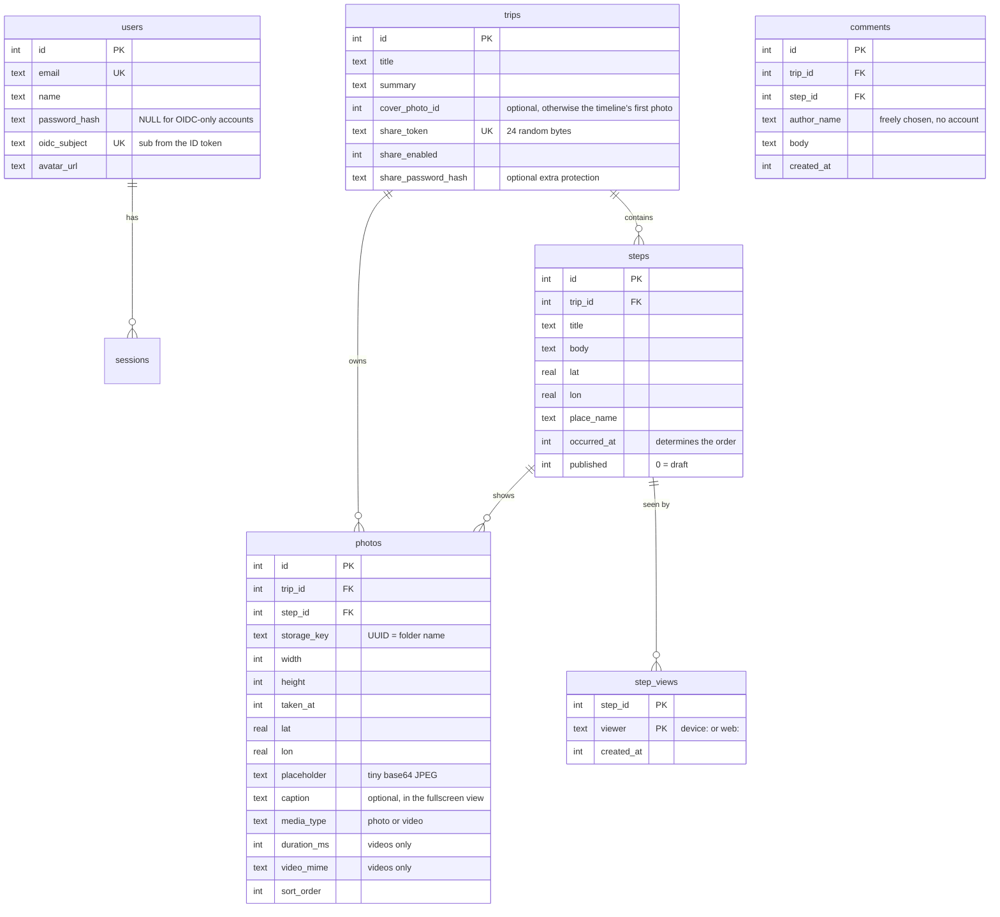
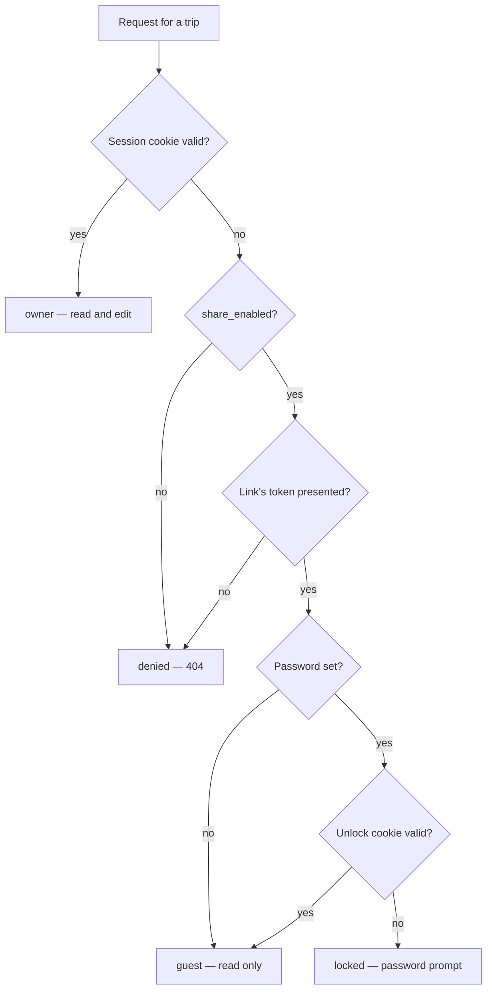

# OwnSteps – Architecture and decisions

This file is for everyone working on the code. It describes how the pieces
fit together and **why** they are built the way they are. The usage and
deployment guide lives in the [README](../README.md), a summary of the most
important rules in [AGENTS.md](../AGENTS.md), and the agreed plan for the API,
the iOS app and the open source release in [ROADMAP.md](ROADMAP.md).

Code, comments, docs and commits are in English ([E15]). The user interface
speaks English (default) and German ([E16]).

---

## 1. What it is about

A travel journal as a Polarsteps replacement on your own VPS. You create a
trip, upload photos on the road and write some text; place and time come
automatically from the EXIF data. Family and friends follow along through a
secret link, without an account.

The target size drives many decisions: **one household or group of authors,
one container, a handful of trips with a few hundred photos.** Nothing here is
designed for multi-tenancy or horizontal scaling, and that is intentional.
Separate groups run separate instances.

---

## 2. Tech stack

| Building block | Choice | Why |
| --- | --- | --- |
| Framework | Next.js 16, App Router, Turbopack | Server Components keep data logic on the server; SSR gives the share link usable OG previews |
| Database | SQLite via better-sqlite3 + Drizzle | One file, no second container instance, backup = copy a folder |
| Images | sharp | Produces the web sizes; prebuilds for Linux available |
| EXIF | exifr | Reads GPS and capture time, copes with missing and broken metadata |
| Map | MapLibre GL **v5** | Free library, see decision [E9] on the version |
| Map data | MapTiler via our own proxy | Nice vector look, key stays on the server |
| Passwords | bcryptjs | Pure JavaScript, no native build problems |
| OIDC | jose | Only JWKS verification needed, no heavy auth library |
| Styling | Tailwind CSS v4 | Color tokens in `globals.css`, light and dark via CSS variables |

---

## 3. Directories

```
src/
├── app/
│   ├── (app)/            Everything behind sign-in. The layout checks the session
│   │   ├── page.tsx      Trip overview
│   │   ├── actions.ts    Server Actions for trips, steps, sharing
│   │   ├── settings/     Accounts, password, sign-out
│   │   └── trips/…       Trip view, step editor, trip management
│   ├── s/[token]/        Public share link (no sign-in layout!)
│   ├── login/, setup/    Sign-in and initial setup
│   ├── api/              Route handlers (see below)
│   ├── layout.tsx        Root layout, metadata, viewport
│   ├── manifest.ts       PWA manifest ("add to home screen")
│   └── globals.css       Color tokens, component classes, MapLibre tweaks
├── components/           Client components (map, timeline, lightbox …)
├── db/                   Schema and connection including migrations
├── lib/                  Server logic, almost all of it "server-only".
│   │                     Without "server-only" and therefore usable in the
│   │                     browser too: view-types.ts, format.ts, limits.ts,
│   │                     errors.ts, messages.ts, schemas.ts
│   ├── i18n/             UI languages: en.ts/de.ts dictionaries, locale
│   │                     negotiation, getI18n() (server), useI18n() (client)
│   └── services/         Use cases shared by Server Actions and the API
├── proxy.ts              Access log (in Next 16 the successor of
│                         middleware.ts – the old file is deprecated)
└── instrumentation.ts    Runs once on server start
```

### Route handlers

| Path | Purpose |
| --- | --- |
| `POST /api/upload` | Receive photos, process them, update the step |
| `DELETE /api/upload?photoId=` | Delete a single photo |
| `POST /api/trips/[id]/cover` | Upload a trip's optional cover image |
| `GET /api/photos/[id]/[variant]` | Serve media to signed-in users, **with access check** |
| `GET /api/share-media/[token]/[id]/[variant]` | Serve media to share-link guests, the token is the credential |
| `GET /api/map/[...path]` | Proxy to MapTiler, appends the key on the server |
| `GET /api/geocode?lat=&lon=` | Place name for a pin set by hand |
| `GET /api/geocode/search?q=` | Place search with suggestions for the editor |
| `GET /api/auth/oidc/start` | Start OIDC sign-in |
| `GET /api/auth/oidc/callback` | Return from the provider, create the session |
| `GET /api/health` | Healthcheck for Docker |
| `/api/v1/…` | REST API for the app, see section 5 |

Everything else in the web UI goes through **Server Actions** – forms
therefore work without JavaScript too. The iOS app uses the versioned REST API
under `/api/v1` instead (see *REST API* in section 5).

### Service layer

Server Actions and route handlers are thin: they unpack the request, call a
function in `src/lib/services/` and refresh or serialize the result. The
services hold the actual use cases – validation, existence checks, the
"publish with the first photo" rule – so the web UI and the upcoming REST API
can't drift apart.

- **Input is validated with Zod** (`src/lib/schemas.ts`). Every issue carries
  an error code as its message; `parseInput()` turns the first one into a
  `ServiceError`.
- **Services never produce user-facing text.** They throw
  `ServiceError(code)` (`src/lib/errors.ts`, which also maps each code to an
  HTTP status). The web UI translates codes via `messageFor()` in
  `src/lib/messages.ts` (texts in the `errors` section of the dictionaries,
  [E16]), and Server Actions use `failure()` from
  `src/lib/action-result.ts` to turn them into the `{ error }` shape the
  forms show – in the request's language.
- **Services don't know how access was established.** Sign-in checks stay in
  the caller (`requireUser()`); `postComment` takes a `resolveAccess`
  function, so the API can plug in token-based access later.
- **`redirect()` stays after the `try` block.** It works by throwing;
  `failure()` would rethrow it correctly, but keeping it outside makes the flow
  obvious.

---

## 4. Data model



Important quirks:

- **Timestamps are Unix milliseconds as INTEGER.** The exception is
  `trips.start_date` / `end_date`: they're stored as `YYYY-MM-DD`, because a
  trip's date range is a calendar date without a time – turning it into a
  millisecond would mean inventing a precision nobody entered. Both fields are
  optional; where they're missing, the range of the steps steps in
  (`formatTripRange` in `src/lib/format.ts`). **Always read them with
  `fromDateInput()`**, never `new Date("2026-07-01")` – the latter parses the
  string as UTC and shifts the date by a day depending on the time zone.
- **`steps.occurred_at` determines the sort order**, not `created_at`. A photo
  uploaded later slides into the right place. The **time of day is never
  shown** and can't be set – the editor only has a date. It comes from the
  EXIF data and orders several steps on the same day; `withDate()` in
  `format.ts` therefore only swaps the date part when saving.
- **`steps.title` is no longer used.** The place (`place_name`) serves as the
  heading. The column stays so existing installations don't need rebuilding.
- **`photos.trip_id` is redundant** with `steps.trip_id`, but it makes the
  access check when serving a single join and allows photos without a step
  (the cover image).
- **`step_views` holds one row per step and reader**, never a running
  counter, so a reader coming back doesn't count twice ([E17]). It isn't
  part of the change log.
- **`photos.step_id` cascades (`ON DELETE CASCADE`)**: step gone, photo rows
  gone. The *files* are cleaned up by `deletePhotoFilesFor` – every deletion
  path has to do that itself, SQLite doesn't know about the disk.

---

## 5. Access model

There are **no roles and no ownership**: whoever is signed in may do
everything ([E2]). The only real boundary runs between "signed in" and "has a
share link".

All checks go through **one** function, `resolveTripAccess`
(`src/lib/share.ts`):



- **Sessions**: 32 random bytes in the cookie `ownsteps_session`; the database
  only stores the SHA-256 hash. Lifetime 60 days so the phone stays signed in.
- **Unlock cookie**: not a random token but an HMAC signature over
  `APP_SECRET`, trip ID and the password hash. If the password changes, all
  unlocks automatically become invalid – without cleaning up any state
  anywhere. Compared with `timingSafeEqual`.
- **Guests must present the link's token.** `resolveTripAccess(trip,
  shareToken)` never grants guest access merely because a trip is shared –
  otherwise anyone could reach every shared trip via its sequential ID (that
  hole existed for comments), and rotating the link wouldn't shut anybody
  out.
- **Trips that aren't shared answer with 404, not 403.** A 403 would confirm
  that the token exists.
- **Share-link guests get their media through `/api/share-media/[token]/…`**,
  not `/api/photos`. The token in the path is the credential; `/api/photos`
  never grants access merely because a trip is shared (otherwise every photo
  of every shared trip could be scraped via the sequential ID). Only a
  separately uploaded cover of a trip **without** share password is public
  there.
- **A locked share page tells nothing about the trip.** Behind a password,
  page and link preview (`generateMetadata`) say only "Protected trip"
  (`share.lockedTitle`) – no title, no summary, no cover – until the visitor
  has unlocked it.

> **Rule:** every new path through which trip content leaves the server must
> use `resolveTripAccess`. That applies especially to route handlers – no
> layout checks sign-in on the side there.

### Brakes against guessing

Every password check is braked, in `src/lib/rate-limit.ts` plus the services
that use it – so the web form and the app share one budget:

| What | Per client address | Per target, any address |
| --- | --- | --- |
| Account password (web login, `POST /api/v1/auth/token`, password change) | 10 attempts/min | 10 failures per account per 15 min |
| Share password (web unlock, `POST /api/v1/viewers/redeem`) | 10 attempts/min | 20 failures per trip per 15 min |
| Redeeming a share link | 10/min | – |
| Comments | 5/min | – |

A successful password change also ends every other web session of the
account (`revokeOtherSessions`) and signs out all its app devices
(`revokeAllApiTokens`); the app keeps steps it hadn't sent and sends them
after the next sign-in.

The per-target limits are the ones that matter: an attacker rotating
addresses still only gets a handful of guesses per account or trip. A
genuine user can be locked out for a quarter hour by someone attacking –
the price for it. Share passwords need 8 characters (4 before; existing
ones keep working). The app's empty first try ("does this trip have a
password?") doesn't count as a failure.

**The client address comes from `X-Forwarded-For`, counted from the right**
(`clientAddress`): `TRUSTED_PROXIES` (default 1) says how many reverse proxies
append to it. Taking the first entry, as before, let anyone fake an address
per request and slip past every brake. Directly exposed servers set
`TRUSTED_PROXIES=0`; all requests then share one bucket, the per-target
limits still apply. Limiters live on `globalThis` by name: Server Actions and
route handlers may end up in different bundles but must count together.

### Headers and CSP

`next.config.ts` sets `nosniff`, `Referrer-Policy: same-origin` (share links
carry their secret in the path), `X-Frame-Options: DENY`, a
`Permissions-Policy` (location only for the step editor) and HSTS without
`includeSubDomains` (ignored over plain HTTP, so LAN setups keep working).

The Content-Security-Policy comes from `src/proxy.ts` with a **fresh nonce
per request**; Next puts it on its own scripts. That only works for pages
rendered per request, hence `dynamic = "force-dynamic"` in the root layout.
Scripts need the nonce ('strict-dynamic' lets them load chunks); styles
stay `'unsafe-inline'` because React renders `style` attributes, which
nonces don't cover. MapLibre needs `blob:` for its worker and sprites; map
data comes through `/api/map` on our own origin. The one exception is the
OpenStreetMap fallback without a MapTiler key: its tile server
(`OSM_TILE_ORIGIN`, `src/lib/map-sources.ts`) is allowed in `img-src` and
`connect-src` only then – before, the policy blocked it and the fallback map
stayed empty. **An inline `<script>`
without the nonce, or a third-party origin, is blocked** – extend the policy
in `proxy.ts` deliberately. Not yet checked with a real map: the test setup
has no MapTiler key.

### Secrets and OIDC

`APP_SECRET` signs the unlock cookies. Unset, one is generated into
`DATA_DIR/.secret`. Set but shorter than 32 characters (or obviously not
random), the server refuses to start (`exitOnWeakAppSecret()` in
instrumentation) – it used to fall back silently.

OIDC matches and creates accounts by email only if the provider marks the
address `email_verified` (or `OIDC_TRUST_EMAIL=true` for providers that
check addresses but never say so). Otherwise someone registering at the
provider with your address would land in your account. Known identities
sign in by `sub` as before; an unverified address never overwrites the one
on record, and the allow list only counts verified addresses.

**A new share token needs a confirmation.** `rotateShareTokenAction`
overwrites the old token, which is then gone for good: every link sent out is
dead, without the recipients knowing why. The button in the trip settings
therefore goes through a second step like deleting does (`RotateShareForm`).
That the confirmation collapses again after the work is done is handled by
the token as `key` on the component – if it changes, React rebuilds it.

### REST API (`/api/v1`)

The app's interface ([D11]–[D17] in the roadmap). Route handlers live in
`src/app/api/v1/`, their plumbing in `src/lib/api/`; the use cases are the same
services the web UI calls.

- **Bearer tokens only, no cookies.** `getPrincipal()`
  (`src/lib/api/principal.ts`) knows two kinds: **author device tokens**
  (`osa_…`, table `api_tokens`, one per signed-in device) and **viewer tokens**
  (`osv_…`, table `viewer_devices`, one per reader and trip). Only SHA-256
  hashes are stored. `requireReadableTrip()` is the API's `resolveTripAccess`:
  authors see everything, a viewer its one trip, and only while sharing is on
  – otherwise 403 `trip_not_shared` (the device stays registered and gets back
  in when sharing is switched on again). Everything that changes content
  calls `requireAuthor()`.
- **Sign-in.** Password: `POST /api/v1/auth/token`, switched off by
  `PASSWORD_LOGIN=false`. OIDC: the app opens `/api/v1/auth/oidc/start` in an
  `ASWebAuthenticationSession`; the server runs its normal OIDC flow, and the
  shared callback – seeing `app` in the flow cookie – ends at
  `ownsteps://auth?code=…` with a one-time code (table `auth_codes`, 2 minutes,
  burnt on the first attempt). The app trades it at
  `/api/v1/auth/oidc/exchange` together with its **own PKCE verifier**, so
  another app catching the custom-scheme redirect can't redeem it.
- **Readers.** `POST /api/v1/viewers/redeem` turns a share link (plus the
  password, once) into a viewer token. Any number of readers can redeem one
  link. A new share link or a new share password signs all devices out (the
  password exists to shut people out, and the app's readers never typed the
  new one); switching sharing off only locks them out until it's back on.
  Authors also remove devices in the trip settings.
- **Idempotency.** Steps and photos carry an optional `client_uuid`. A
  repeated `POST …/steps` or `POST …/media` with the same UUID returns what the
  first request created – retries after a dropped connection don't duplicate.
- **Change feed.** Every write in the data-access functions appends to the
  table `changes` (`recordChange()` in `src/lib/changes.ts`): trip, step, photo
  or comment, `upsert` or `delete`. `GET /api/v1/changes?since=<seq>` returns
  what happened after a cursor; deleting a trip or step implies its children.
  Viewers only see their trip's entries. **Anything that writes to trips,
  steps, photos or comments must go through these functions** or record the
  change itself, otherwise the app never learns about it.
- **Views.** A reader's app reports the steps it showed with
  `POST /api/v1/trips/{id}/views`; authors may call it too, they just aren't
  counted. The trip detail carries `viewCount` on every step for authors
  only ([E17]).
- **Errors** are `application/problem+json` with `type`
  `urn:ownsteps:problem:<code>` – the same codes the services throw.
- **The OpenAPI document** (`src/lib/api/openapi.ts`, served at
  `/api/v1/openapi.json`) is built from the Zod schemas in
  `src/lib/api/schemas.ts`; the app's client is generated from it. A test
  compares it with the route files, and another calls every protected route
  without a token and expects 401.
- **Uploads** (`…/steps/{id}/media`, `…/trips/{id}/cover`) are excluded from
  the proxy matcher like `/api/upload` – checked with a 15 MB upload, which a
  non-excluded route truncates at 10 MB.

### The iOS app (`ios/`)

Native SwiftUI, iOS 26+, see `ios/README.md` for building. The app target is
thin; everything testable lives in the local package `OwnStepsKit`, whose
`OwnStepsAPI` target is **generated from `openapi.json`** by
swift-openapi-generator. That file is a copy of `/api/v1/openapi.json`
(`npm run openapi:export`), and a server test fails when the two drift apart.
Two details of the document exist for the generator's sake: request bodies are
marked `required`, and nullable fields with a format are written as
`type: [x, "null"]` instead of `anyOf` – otherwise the generator silently
drops them (`simplifyNullables()` in `src/lib/api/openapi.ts`).

**Layout**: on the iPhone the trips are large cover cards (the trip's
`cover` from the API – the cover photo, else the first one – so the list
needs no second request; older servers leave it out and get a colored
placeholder). With room for it (iPad, regular width) the trips are a sidebar
next to the open trip. Opening a card zooms into the trip, laid out like
Polarsteps (changed on 2026-10-06 – the vertical timeline in a sheet over the
map wasn't intuitive): the route fills the screen, the steps float below it
as cards side by side (`StepPager`), oldest to newest, so the cards run
along the route; the pager opens on the newest ([E13]). The trip itself is
not a card – as the first one it read like one more day, and reaching the
overview meant scrolling to the far left – but a glass bar at the top of
the map (`TripOverviewBar`: cover, dates, steps and photos) that frames the
whole route when tapped. Only a trip without steps shows its cover card in
the pager. Swiping the cards
flies the map to the step (with a selection tick), a tapped marker brings
its card. A tapped card **pushes** the step's page (`StepDetailPager`), with
the system back button and edge swipe; sideways it pages on to the previous
and next step, and going back leaves pager and map at the step reached.
Photos open from there with a zoom transition and close by swiping down.

The look follows the system rather than the web UI (also 2026-10-06, after
"it still feels like a PWA"): the step cards are solid with a soft shadow,
like the place cards of Apple's Maps, with concentric corners (changed on
2026-10-07 – as Liquid Glass they took on the map's colors and were hard to
read; glass stays for small controls over the map: the overview bar, the
photo count). A step's page reads like a page of a travel journal (also
2026-10-07 – the grouped list put a photo grid first and the text small
below it): the lead photo large and up under the bars, then day, date and
the place as a large title, the text as body copy, the other photos in two
columns, "Show on map" and, for authors, the readers, then the comments.
Pages swipe sideways in a paging scroll view, one step per swipe – a
page-style `TabView` kept the status bar free, so the photo couldn't reach
the top. Actions live in the toolbars (⋯ menu top right, previous /
comment / next at the bottom) and behind touch and hold (deleting a
comment, discarding a step still on the device) instead of inline text
buttons.

Two SwiftUI traps from building it: while the step page is pushed, the map
below it can't present anything, so every sheet and dialog of the trip is
attached twice – to the map and to the step page – and only the copy on
top gets the real bindings (`gate()` in `TripView`). Gating the bindings
rather than the modifiers keeps the map's identity; an `if` around the
modifiers would rebuild it each time a step opens. The pushed item is
compared by an ID only (`StepDetailRequest`) and the page shown lives in
separate state – otherwise every swipe sideways would count as a new
destination. And state read only inside a lazy container's closures doesn't
make `body` update: the trip list stayed on its spinner after a first load
into an empty cache, so `body` reads the lists and hands them down.

After a new cover the form loads the trip once more: the card shows the
photo behind `cover`, and with only the new `coverPhotoId` it kept the old
image (or none) until the next pull to refresh. Editing a trip bumps
`tripListRevision`, which makes the list load again.

**Reading** (phase 4b): the trip list and each trip are shown from the GRDB
cache (`TripCache`, responses stored as JSON per account and trip) and
refreshed behind it; offline, a note says how old the copy is. Photos go
through `MediaStore`, which loads them with the account's token and keeps
them on disk – a photo's files never change, so a cached file never goes
stale. After every refresh the timeline sizes of all photos are prefetched,
so a trip once opened stays readable offline; fullscreen falls back to the
cached smaller size. Videos stream through AVPlayer with the token as a
header. Dates and trip days use the server's time zone, which `/info`
reports (`timeZone`, see [E12]) – otherwise a phone in another zone would
show other days than the web.

**Writing** (phase 4c): new steps and their photos go through `UploadQueue`
(an actor over the tables `pending_step`, `pending_upload` and
`uploaded_asset` in the same GRDB database). Saving only records the step
and moves the prepared files into the queue's folder, so it works offline
and survives the app being killed. `process()` then creates the steps the
server lacks – idempotent through `clientUuid`, so a lost response does no
harm – and hands every file to a **background `URLSession`** as a multipart
body written to disk once (background sessions only upload from files; the
same body is reused on every retry). Outcomes: 2xx is done, 401 means
signed out, other 4xx except 408/429 is a permanent failure the user can
retry or remove, everything else backs off (30 s doubling, at most 1 h). The
queue is worked through on launch, when the app comes to the foreground and
when the system wakes it for finished background transfers. A step with
only photos is created unpublished and appears with its first photo, like
[E7]. Until the server has it, the timeline shows a local card with the
pending thumbnails; once an upload finishes the trip is reloaded.
If the server signs the device out (401, e.g. revoked in the web UI) while
steps are still waiting, the queue keeps them under the account's ID and
signing in to that server again takes them over; signing in again while
the account still exists keeps its ID anyway. Only an explicit sign-out in
the app discards unsent work.
Editing, deleting and trip changes go straight to the server and need a
connection (D19 – offline only creates).

Media are prepared at selection time, so saving is instant: photos become
JPEG through ImageIO with their metadata (EXIF date, GPS – taken from the
library asset when the file has none) and step down in quality until they
fit under 25 MB; Live Photos contribute their still. Videos are exported to
1080p MP4 unless "Videos in original quality" is on, and get a poster frame
and their duration. The step's date defaults to the oldest capture date.
`uploaded_asset` remembers which library photos already went up, for the
photo suggestions. Every photo can get a caption before uploading; it
travels in the queue (`pending_upload.caption`) and as a `caption` field
with the upload.

The step's place has three sources ([E8]): **from a photo** (preselected
when one carries a position – from its EXIF data, the library, or for
videos the recording location in the file), **my location**, or **on the
map** (a pin to move, with Apple's place search). Photos from different
places – more than a kilometre apart – are offered as a choice; the
earliest one is preselected, like the date, and each photo keeps its own
position either way. The app sends the chosen position with the step:
otherwise the server would take whichever photo happens to arrive first.
A position without a name (looked up on the device, offline not possible)
is named by the server like photo positions.

Deleting a trip asks for its name, like the web; the trip's cached copy
and whatever was still queued for it go too.

**Convenience** (phase 4d, [D21]/[D22]):

- *Share Extension* (`ios/ShareExtension/`): photos and videos shared from
  Photos or another app become a new step in a chosen trip. App and
  extension share an app group (`group.<prefix>.app`: account list, upload
  folder, an inbox, the trip list as `share-targets.json`) and a keychain
  group (`<TeamID>.<prefix>.shared`: the tokens). **Only the app opens the
  SQLite file** – iOS ends a suspended process that holds a lock on a file
  in a shared container, and two writers to one queue invite exactly that.
  The extension instead writes its step and files into the inbox first
  (`ShareSubmitter`), then creates the step and starts the uploads in a
  background session of its own (`ownsteps.share.<uuid>`, one per share, so
  app and extension never use the same session at once). On every launch
  the app takes the inbox into its queue (`importInbox`) *before* it joins
  the extension's sessions, so their results find their rows. Both can run
  at once (the app woken in the background while the share sheet is open),
  so inbox files are only touched through `NSFileCoordinator`, and the app
  takes over a submission only once the extension marked it finished – or
  after ten minutes, when the extension was evidently ended halfway. Rows
  the queue already has are never overwritten by a second import. Uploads that
  finish while the extension still runs report to the extension; it takes
  them off its submission, otherwise the app would send them again (the
  server would only answer with the existing photo, but the bytes go out
  twice). Offline, the extension just leaves the submission for the app.
  Media preparation is shared code (`MediaPreparation.preparePhoto/Video`)
  and runs one file at a time – an extension gets far less memory. ImageIO
  converts HEIC to JPEG in tiles: a 48 MP photo peaked at under 30 MB
  (measured on the Mac), so the extension keeps full resolution too.
- *Photo suggestions*: library photos from the trip's period that aren't in
  it. The period is the entered dates, else the steps; without an end date
  it runs until now, at most two weeks past the last step. Out are
  screenshots, what this device uploaded (`uploaded_asset`), what the user
  hid (`ignored_asset`) and what looks like a photo already on the server –
  same capture second (allowing for whole quarter hours of zone offset, see
  [E12]) plus same size, or same length for videos; that catches photos
  uploaded through the web. The logic is `PhotoSuggestions` in the Kit and
  tested there. The app only asks for photo access when the user opens the
  suggestions from the trip menu; afterwards a card above the timeline says
  how many are waiting ("Not now" hides it until newer photos turn up).
- *Share sheet*: trip and step links are the trip's share link, for a step
  with `#step-<id>`, which the web jumps to. With sharing off, the app offers
  to switch it on first. `UIActivityViewController` is presented by UIKit –
  inside a SwiftUI sheet it sits at the wrong height.

**Readers and news** (phase 4e, [D16]–[D18]):

- *Following*: an invitation is the trip's share link – opened as
  `ownsteps://join?url=…` from the share page, scanned from the QR code in
  the author's "Readers" sheet, or pasted. `Invite` derives the server from
  it. Redeeming it with a name gives a viewer token for that one trip; the
  share password is only asked for when the server answers
  `share_password_wrong`. Each followed trip is its own account of kind
  `viewer`, so one app follows trips on any number of servers. Readers see
  the timeline and map, and can comment (under their name, never typed
  again); everything else is hidden. "Stop following" tells the server to
  forget the device.
- *Readers sheet* (authors): QR code and share sheet for the link, the list
  of reader devices with "last seen", removing one or all. With sharing off,
  it offers to switch it on.
- *Notifications* without push: `BGAppRefreshTask` (and every return to the
  foreground) follows each account's change feed from a cursor kept per
  account. Trips that changed are fetched again – which also keeps the
  offline copy fresh – and compared with the cached copy (`TripNews`):
  readers hear about new steps, authors about comments by others. Edits
  don't notify, and nothing does on the very first run. Only the
  background run posts notifications; each can be muted per trip. Runs are
  queued one after the other (two at once would notify twice), and the
  cursor only moves on once every changed trip was fetched. A tapped
  notification opens the trip at that step. The simulator never schedules
  refresh tasks, so debug builds run the same check when sent to the
  background with `-OwnStepsDebugNewsInBackground YES`.

Photos are cached on disk by `MediaStore` only, under the photo's
`fileKey` (a hash of its storage key, new with every upload) – photo IDs
alone aren't enough: a server restored from a backup hands them out again,
and the cache served the old images. Its session has no `URLCache`, which
kept a second copy outside the account's folder, still there after signing
out.

A background wake-up for finished uploads hands iOS's completion handler to
the session's uploader, which calls it once the session reported "all
events delivered" – in whichever order the two arrive. The app first imports
the inbox before joining sessions, so the session may already be done by the
time the handler gets there.

Three concurrency traps (the app target runs on the main actor by
default): **upload progress** must be thinned out – URLSession reports
every few kilobytes, and passing each report to the UI flooded the main
thread until iOS killed the app (`0x8BADF00D`); `BackgroundUploader` passes
on whole percents only, and the trip reloads once after a burst of finished
uploads, not after each. A step written on the device keeps its pager card
when it reaches the server (both are keyed by the step's client UUID), so
the pager doesn't jump under the user. **Heavy work** like converting a 48 MP HEIC must be
moved off explicitly (`@concurrent`), or it runs on the main thread.
And **closures handed to Photos or NSItemProvider** must not be written in a
main-actor function: those frameworks call back on their own queues, and
Swift 6 traps when a main-actor closure runs elsewhere – the functions that
create them are `nonisolated`.

Two MapKit/SwiftUI traps: with `.hybrid(elevation: .realistic)` the map
draws the route but no annotations at all, so the style stays flat. And a
`fullScreenCover` per List row presented another row's photos (cell reuse);
the timeline owns one viewer for all steps. A GRDB trap: the coding
strategies (`databaseUUIDEncodingStrategy` and friends) must be declared as
`static func …(for:)`; declared as `static let` they are silently ignored
and UUIDs end up as blobs.

Bundle IDs derive from `APP_BUNDLE_ID_PREFIX` in `ios/Config/Base.xcconfig`
(`de.ownsteps`); the signing team stays in the ignored `Secrets.xcconfig`, so
forks build with their own prefix and team. Tokens live in the Keychain, the
account list in UserDefaults – both in the groups shared with the extension;
entries saved before those existed are moved over on first read. The PKCE challenge is computed the same way on
both sides; a test on each side checks the RFC 7636 example.

### Comments

Whoever may see the trip may also comment – name and text are enough, no
account needed. `addCommentAction` checks the same function
`resolveTripAccess` for that; the comment form on the share page sends the
link's token along. Only signed-in users may delete.

Against accidental double clicks and blunt spamming, `postComment`
(`src/lib/services/comments.ts`) has a brake: at most five comments per
minute and sender (client address on the web, token in the app). It is a
`createRateLimit` like every other brake and deliberately lives in memory – for an instance serving two families a table
would be overkill, and after a restart it may just as well start from zero.

---

## 6. Image and video pipeline

```
Browser ──(one file per request)──> POST /api/upload
                                        │
                            exifr: GPS + capture time
                                        │
                  sharp: decode once, rotate() per EXIF,
                     scale to 2400 px, keep as raw pixels
                                        │
              ┌──────────────┬──────────┴───────┬──────────────┐
          thumb 480       medium 1280       large 2400      original
           WebP 70          WebP 78          WebP 80       unchanged
              └──────────────┴──────────────────┴──────────────┘
                       data/uploads/<storage_key>/
```

- **Upload happens file by file**, not as one big request. That keeps memory
  use on the VPS small and gives honest progress along the way
  (`StepEditor.tsx`).
- **Media are only served through `/api/photos/[id]/[variant]` and
  `/api/share-media/[token]/[id]/[variant]`.** Nothing lives in `public/`,
  otherwise every photo would be public by guessing URLs.
- **`placeholder`** is a JPEG about 20 px wide stored as a data URI in the
  database. `PhotoImg` puts it as a CSS background under the ``; that
  gives a blur-up without a single line of JavaScript.
- **The original is decoded once.** Variants and placeholder are all made
  from one raw, rotated copy at the `large` width. Decoding the original
  for every variant cost most of the time: a 24 MP JPEG went from about
  685 ms to 410 ms. `large` stays pixel-identical; thumb and medium differ
  by 1–2 levels on average from scaling down from 2400 px.
- **After `sharp.rotate()`, portrait images swap width and height.**
  `processUpload` corrects that using the EXIF orientation – otherwise wrong
  aspect ratios end up in the database.
- **From the first photo with GPS**, the step takes place and capture time,
  and `reverseGeocode` turns that into a place name. Only as long as the step
  hasn't set anything of its own.

### Videos

Videos live in the same folders as photos, as a file named `video`; the three
image sizes then show the **poster frame**. That way grid, map and fullscreen
view treat both media alike – only `photos.media_type` tells them apart.

**The browser creates the poster frame**, not the server: when a file is
picked, the video is loaded into a `<video>` element, seeked in a bit (the
first frame is often black) and the frame is grabbed as JPEG via a
`<canvas>`. That spares the image ffmpeg with its roughly 150 MB and build
time; every device that recorded the video can decode it anyway. The price: no
video upload without JavaScript, and the video file is stored **unchanged** –
there's no transcoding.

Videos are served with **range requests** (`Range`, status 206). Without them
seeking in the video wouldn't work, and Safari sometimes refuses to play it
at all.

> **Poster frame trap:** the `<video>` element runs with
> `preload="metadata"`. Waiting for `loadeddata` waits forever – that event
> requires loaded image data, which never arrives with this setting. The right
> way: wait for `loadedmetadata`, then set `currentTime` and wait for
> `seeked`; for the seek the browser loads exactly the section needed. The bug
> sent every video upload into a timeout **before** anything was sent to the
> server – which is why the server logs were silent. If the poster frame still
> fails (e.g. with a codec the browser can't decode), a fallback image is
> generated and the video is uploaded anyway.

**Videos are not transcoded.** Whatever the device records lands on disk
unchanged. Shrinking would need ffmpeg in the image (saves disk space, not
upload time) or conversion in the browser, which runs in real time – a
three-minute video then costs three minutes of waiting.

#### Where the size limit comes from

`src/lib/limits.ts` keeps the limits in one place because both the editor
(before uploading) and `/api/upload` (afterwards) need them: **25 MB per
image, 400 MB per video.** The editor checks first – otherwise a hundred
megabytes travel over the network only for the server to reject them.

**Uploads are streamed to disk, not buffered.** Every upload route parses
its body with `parseMultipart` (`src/lib/multipart.ts`, on top of
`busboy`): each file goes straight into `DATA_DIR/tmp/` and stops being
written the moment it crosses its limit. A video is then moved into its
storage folder with a rename (same disk) and never passes through memory;
images are read whole because sharp needs them, at most 25 MB. Before,
`request.formData()` held the whole body plus a `Buffer` copy – a 400 MB
video briefly needed about a gigabyte. Measured on the dev server with a
300 MB video: about +1.4 GB peak before, about +0.24 GB after (most of it
compiling the route); with the route already compiled, about +70 MB. The
temporary files go in a `finally`; whatever a restart cut off is cleared at
startup (`clearTmp`). The 400 MB are now about disk space and upload time.

In front of that sit two limits OwnSteps doesn't know about and that show up
differently: the **reverse proxy** (nginx `client_max_body_size`, with
Pangolin the tunnel's setting) aborts with `413`, and its **timeout** cuts
long uploads over a thin connection. An upload that fails without an app log
line almost always got stuck there.

---

## 7. Map

`getMapStyle()` (`src/lib/map.ts`) is resolved **on the server** and returns
either the proxy URL `/api/map/maps/<style>/style.json` (if a `MAPTILER_KEY`
is set) or an embedded OpenStreetMap raster style as a fallback.

The proxy (`/api/map/[...path]`) forwards requests to `api.maptiler.com` and
only appends the key there. It is public – share links need the map – so it
only forwards what a style loads (`maps/`, `tiles/`, `fonts/`, `resources/`,
no static maps; `isMapAsset`). Geocoding and the other MapTiler APIs must
not run on our key for anonymous callers. JSON responses go through `rewriteMapTilerJson`
(`src/lib/maptiler-rewrite.ts`), which

1. points every `https://api.maptiler.com/…` at our own proxy and
2. removes the `key=` parameter.

The rewrite is **deliberately text-based**. A `URL` object would
percent-encode the placeholders `{z}/{x}/{y}` and `{fontstack}/{range}`, and
MapLibre only replaces literal braces.

The address inserted comes from `publicOrigin()`: first `PUBLIC_URL`, then
`x-forwarded-proto` and `x-forwarded-host`, and only last `request.url`. This
order matters twice:

- **`request.url` alone is wrong behind a reverse proxy.** TLS ends at the
  proxy there, the server itself speaks HTTP. The browser blocks the resulting
  `http://…` address on an HTTPS page as mixed content – the map stays empty
  without an error message.
- **A bare path (`/api/map/…`) isn't enough.** MapLibre loads the vector tiles
  in a worker created from a blob; its `location` is a `blob:` URL and can't
  serve as a base for relative addresses. The tiles would never arrive while
  background and labels were already there – visible as a flat colored area.

That's why `PUBLIC_URL` isn't only for share links but also makes the map
unambiguous behind a proxy.

The target is checked via `target.origin !== UPSTREAM` so the path can't point
at a foreign host. For a while there was a block against
`Sec-Fetch-Site: cross-site`; it has been removed again: anyone omitting the
header got through anyway – so it protected nothing – while it could block
requests from MapLibre's worker.

**The rewritten JSON responses are served with `no-cache`**, tiles, sprites
and fonts on the other hand for a day. The difference matters: the JSON files
contain the addresses built from `PUBLIC_URL`. With a long lifetime, a browser
clings to dead URLs for days after a move or config change, and the map stays
empty although the server has long been delivering the right thing. Exactly
that happened on the first deployment – debugging went nowhere because `curl`
showed correct addresses while the browser still used old ones.

The default style is **`hybrid`** (satellite imagery with subtle labels).
Photo markers and route look much better on aerial imagery than on a street
map – that was the most visible difference to the role model Polarsteps.
Matching that: the route as a **white line with a dark casing** (two layers
on top of each other) and markers with a **white ring** instead of colored
highlighting. The active step only grows, so the photo stands out, not a
signal color. Other styles can be set via `MAP_STYLE`, e.g. `satellite`,
`outdoor-v2` or `streets-v2`.

Over the map, `MapTimelineStrip` provides a strip for paging through the
steps; it snaps to each entry and moves the map along. Tapping the already
active step jumps to it in the timeline.

**The strip keeps its distance from the bottom edge of the screen** (2.5 rem
plus `safe-area-inset-bottom`). If it stuck to the bottom, it would sit in the
swipe area of iOS and iPadOS – paging would then end up in the app switcher
instead of the strip. For the same reason the cards are big enough to hit
(17 rem wide, 64 px preview image, 20 rem from `sm`). Whoever changes the
width must adjust the padding `px-[calc(50%-…)]` too: it centers the snap
points and is exactly half the card width.

**In map mode the height is measured, not calculated.** On phones the map
should reach down to the bottom edge; how much space sits above it depends on
the view – the signed-in one has a header bar, the share link doesn't. A fixed
calculation like `100dvh - 11rem` shrank the map to a third in the visitor
view. Now `getBoundingClientRect().top` provides the starting point, and the
header steps back entirely on narrow screens.

In `TripMap.tsx`:

- **Markers don't depend on the `load` event.** They're plain DOM elements and
  are placed right away; even if no tile gets through, you see the steps.
- The **route line** is a style layer and needs a loaded style. `syncRoute`
  therefore runs immediately *and* on `load` *and* on `styledata` – the
  function is deliberately idempotent.
- A `ResizeObserver` calls `map.resize()`, because the container toggles
  between visible and hidden on phones.
- **The camera only follows when the points have changed** (comparing a
  signature of IDs and coordinates). Without that, every keystroke in the
  editor reset the view. With `autoFit={false}` it only fits once at all –
  whoever is searching for a place there decides the map section.
- `map.on("error", …)` logs style and tile errors MapLibre would otherwise
  swallow silently.

---

## 8. Views: timeline, grid, fullscreen

`TripView` is the **only** reading view: the signed-in trip page and the share
link render the same component and differ only in two props – `header` (the
page contributes its header) and `editable` (shows the edit links). What
visitors see is thereby necessarily the same as the signed-in view; a second
view could drift apart.

The boundary to the client is drawn by `toViewStep()` in
`src/lib/view-types.ts`. It deliberately only returns what's shown: IDs,
dimensions, placeholder, caption, media type. **Storage keys, file names and
owners stay on the server** – otherwise they'd be in the HTML of every shared
link.

**Order:** newest step on top, see [E13]. Only the display is reversed.

### Timeline

An `<ol>` with a continuous line and one dot per step. Which step is currently
being read is reported by an `IntersectionObserver` with the window
`-15% 0px -60% 0px` – i.e. the upper third. The active step colors its dot and
drives the map at the same time.

After clicking a marker or an entry in the map strip, `suppressObserver`
pauses tracking for 800 ms. Without that, scrolling to the target overrides
the choice just made along the way.

On the authors' page every step shows how many readers have seen it
(`viewCounts`, [E17]) – only if the trip is shared or was read before, so
a private trip doesn't say "0 views" everywhere. On the share page the same
component reports what the visitor read (`useStepViews`).

The "timeline / map" toggle **deliberately doesn't stick** – a bar scrolling
along above the timeline feels restless.

**Side by side only from `xl` (1280 px), not from `lg`.** An iPad in landscape
measures about 1194 px; with `lg` that left 628 px for the timeline and 460 px
for the map, and both felt cramped. Up to `xl` each view therefore gets the
full width via the toggle; from `xl` they sit side by side (map 520 px,
`sticky`) in a frame up to 1280 px wide.

Below that, the mode decides the frame's width: the timeline gets a reading
column with `max-w-3xl` – stretched over the full 1150 px of a tablet the
lines would be unreadable – while the map gets `max-w-6xl` and thus
everything. That's why the width depends on the `mobileView` state and not on
breakpoints alone.

### Grid (`PhotoGrid`)

The layout depends on the count: one fills the width, three give the first
one the whole top row, from five on the fourth cell shows `+n`. Videos get a
play button and, if known, their length overlaid.

A tap opens the fullscreen view with **all** media, not just the four visible
ones – the rest behind `+n` would otherwise be unreachable.

`PhotoImg` puts the LQIP placeholder as a CSS background under the ``
(see [E5]); without `next/image` there's no optimization service converting
the images a second time.

### Fullscreen view (`Lightbox`)

All media sit side by side in a row; the whole row is shifted via
`translateX`. That way the image follows the finger while swiping instead of
only jumping on release. From 22 % of the screen width the next one snaps in;
at the start and end the row only follows at 30 %, so you can feel that
nothing more is coming.

| Gesture | Photo | Video |
| --- | --- | --- |
| Tap | left goes back, otherwise forward | nothing – belongs to playback |
| Swipe | pages | pages (except on the control bar) |
| Double tap | zoom to 2.5× | – |
| Two fingers | zoom up to 4× | – |
| Swipe down | closes | closes |
| Arrows | visible from `sm` | always visible |

The **caption** sits below the medium and applies to photos and videos alike.
When the browser hands the video to its own fullscreen view, it only shows the
video – caption and arrows are gone until leaving it.

The trapdoors of this view – page zoom, control bar, `100svh`, video
positions – are collected in section 12.

### Comments

`CommentSection` hangs below every step. Writing works without sign-in,
deleting only with it (`editable`). The details on abuse protection are in
section 5.

---

## 9. Sign-in

**Password** (`src/lib/auth.ts`): bcrypt with cost factor 12. `verifyPassword`
compares against a dummy hash even if the account has no password at all –
otherwise the response time would reveal which accounts exist.

**OIDC** (`src/lib/oidc.ts`), authorization code flow with PKCE:

```
/api/auth/oidc/start
   → PKCE verifier, state, nonce, target into a short-lived cookie
   → redirect to the authorization_endpoint
Provider (e.g. Pocket ID)
   → back to /api/auth/oidc/callback
   → check state, exchange code for tokens
   → verify ID token via JWKS (issuer, audience, nonce)
   → upsertOidcUser: first via sub, then via email, otherwise create
   → create session, continue to the original target
```

The `next` target is restricted to same-site paths so the sign-in can't serve
as an open redirect. `OIDC_ALLOWED_EMAILS` can narrow the circle further.

If no account exists yet, `/login` leads to `/setup`. That page locks itself
as soon as an account exists. Alternatively `ADMIN_EMAIL` / `ADMIN_PASSWORD`
create an account on first start (`seedAdminFromEnv` in `instrumentation.ts`).

---

## 10. Migrations

There is **no** `drizzle-kit generate` and no migration files. Instead,
`src/db/index.ts` holds the array `MIGRATIONS` with named SQL. On startup,
everything not yet listed in the `_migrations` table is executed.

> **Rule: append only, never change an existing entry.** Changing `0001_init`
> changes nothing on installations already running – the migration has long
> been checked off there.

When the Drizzle schema in `src/db/schema.ts` is extended, that **always**
comes with a new `MIGRATIONS` entry; the schema itself creates no tables.

Startup is safe against concurrent processes (Next starts several workers for
the build, and on a container restart old and new overlap):

1. `busy_timeout` is set **first thing**.
2. `journal_mode = WAL` runs with retries and tolerates failure – the mode is
   stored in the file, another process may have set it. SQLite explicitly
   doesn't apply the busy handler to this pragma.
3. The migration runs in an `immediate()` transaction, **the check against
   `_migrations` happens inside it**, plus `INSERT OR IGNORE`.

---

## 11. Decisions made

### [E1] SQLite instead of PostgreSQL
A few users, one container, one volume. A second database instance would
complicate operations without contributing anything. A backup is a `tar` of
`data/`. Limit: there's no real write concurrency – irrelevant for this use.

### [E2] No permission management
Explicit wish: people writing together on the same trips. Every signed-in
account may edit every trip. `requireUser()` is the entire authorization.
**Don't "fix" this unless asked** – the simplicity is the point. Groups that
need separation run separate instances.

### [E3] Own session handling instead of Auth.js
Cookie plus database table doesn't need a library with an adapter layer. The
whole code is in `src/lib/auth.ts` and readable in one sitting. OIDC was added
later and fit in next to it without restructuring.

### [E4] Photos behind a checked route
Files in `public/` would be reachable for anyone who guesses the URL or gets
it passed on – unacceptable for private travel photos. The detour via
`/api/photos/…` costs some throughput, which a private VPS easily has.
Cache header `private, max-age=31536000, immutable`, because `storage_key` is
unique per image.

### [E5] No `next/image`
The variants are precomputed as WebP on upload. A second optimization layer
would only cost CPU time and cache space. The blur-up comes from the stored
placeholder.

### [E6] MapTiler key via a proxy
Otherwise, with a shared link, the key would sit in the source of every public
trip and be abused before long. The proxy is the reason `maptiler-rewrite.ts`
exists at all.

### [E7] A step is published with its first photo
The editor creates a draft when it opens (`startStep`) so the photos
have a target right away. If the step only became visible on save, material
uploaded on the road would be lost as soon as someone left the page. That's
why `/api/upload` sets `published = true` as soon as a photo is through.
Drafts without photos are cleaned up by `cleanupStaleDrafts` after seven days
(at startup and then once a day, `src/instrumentation.ts`). Startup also
removes separately uploaded covers no trip points at any more
(`cleanupOrphanedCovers`); replacing a cover removes the old one right away.

### [E8] Place primarily from EXIF, with three fallbacks
Explicit wish: nothing should have to be entered by hand on the road. In
practice that's not enough – iOS strips the position when sharing, depending
on the route. So there are additionally, in this order: the **device
location** button (the device's position), the **place search** in the place
field (MapTiler geocoding; picking sets name, coordinates and map section) and
finally **tapping the map**.

The app offers the same as a choice when writing a step – from a photo
(preselected), my location, on the map – see "The iOS app" in section 5.

### [E9] Pin maplibre-gl to version 5
v6 derives its worker's address from `import.meta.url`. After bundling, that
points to a path below `_next/static/chunks/` where no worker lives; Next
serves its 404 page there, and the browser rejects it as a module script
("non-JavaScript MIME type"). The map then hangs without any error message.
v5 ships the worker as a blob and doesn't have the problem. **Before
upgrading to v6, the map rendering must be checked in a real browser.**

The price is GHSA-jrc7-96c5-q579, an XSS bypass in v5's HTML sanitizer that
`npm audit` reports as critical; the fix is v6.4.1. The only HTML OwnSteps
hands to MapLibre is source attribution (no popups, no `setHTML`): the OSM
fallback's is our own constant, MapTiler's comes through `/api/map`, where
`sanitizeAttributions` reduces it to text and plain `https` links – the
workaround the advisory names. The nonce CSP blocks the inline handlers
such a payload needs on top of that.

### [E10] Debian instead of Alpine in the image, install without scripts
`better-sqlite3` and `sharp` ship ready-made binaries for glibc. On musl at
least `sharp` would have to be resolved via the matching platform variant. A
few hundred MB of image are no issue on a VPS.

Installation uses **`npm ci --ignore-scripts`**. Reason: `better-sqlite3`
contains a `binding.gyp`, and when it's present npm runs `node-gyp rebuild` on
its own – even without an `install` script in the package. The slim image has
neither Python nor a compiler, so the build aborts there:

```
gyp ERR! find Python – Could not find any Python installation to use
```

Nothing needs compiling, though: the package ships binaries for linux-x64 and
linux-arm64 (verified: database and `sharp` work fine after an install without
scripts). If a package that really needs an install script is added later,
install `python3 make g++` in the deps stage – but please only there, so the
runtime image stays slim.

### [E11] German as project language – superseded by [E15]
Originally UI, comments, commit messages and error messages were German.
Replaced when the project was prepared for open source.

### [E12] Time zones deliberately unhandled
EXIF capture times rarely carry a time zone. Reading and formatting happens in
the server's time zone, so the UI shows exactly the time the camera recorded.
For a travel journal that's the desired reading – a sunrise photo in Norway
should show the local time there. Whoever moves the container should keep
`TZ` stable.

### [E13] Timeline newest first, everything else chronological

The timeline is displayed with the **newest step on top**: readers come back
for what's new and shouldn't have to scroll through half the trip first. But
**only the display** is reversed – `getSteps()` still returns ascending, and
`TripView` only reverses the list when rendering (`timelineSteps`).

The reason lies in the same data: day counting ("day 6") measures from the
first day, the date range in the header needs start *and* end, and the route
line on the map connects the points in exactly the array's order. A globally
reversed list would draw the route backwards and hang the day count on the
end of the trip. For the same reason the strip over the map stays
chronological: it depicts the path, not the news feed.

The step active on opening is therefore `steps.at(-1)` – the top step of the
timeline and the last point of the route.

The app's step cards (since 2026-10-06) follow the route as well: oldest on
the left, newest on the right. They open on the newest card, so readers
still land on what's new.

### [E14] An entered date range beats the steps

`trips.start_date` and `end_date` are optional but take precedence once set.
The steps only show how far writing has got – whoever enters "July 1–20"
doesn't want to read "July 1–3" just because the rest is still missing.
Without an entry everything stays as before and the range comes from the
steps; existing trips don't change.

The same applies to day counting: **day 1 is the entered trip start**,
otherwise the first step. Whoever writes for the first time on the fourth day
reads "day 4", not "day 1" again.

The two dates travel separately: `formatTripRange()` gets the trip and the
steps' range and decides itself, `TripView` only gets `startDate` – the
timeline doesn't need the end.

### [E15] English as project language, German as second UI language
Decided on 2026-09-30 when preparing the open source release: code,
comments, docs and new commits are English, so people outside the
German-speaking world can use and contribute. The UI becomes bilingual
(English default, German) before the release. The existing git history stays
German. The database schema was English from the start, so the switch needed
no migration.

### [E16] UI languages without locale URLs
The web UI speaks English (default) and German (D4 in the roadmap). The
language is **not** part of the URL: a share link is sent around a family
and every reader should get their own language from the same link. So each
request resolves it on its own (`getLocale()` in `src/lib/i18n/server.ts`):
the cookie of the manual switch (`ownsteps_locale`, set by
`setLocaleAction`), otherwise `Accept-Language`, otherwise English. Pages are
rendered per request anyway (nonce CSP), so this costs nothing.

- **Texts live in `src/lib/i18n/en.ts` and `de.ts`**, nested by area
  (`t.trips.heading`). `en.ts` is the reference; `de.ts` is typed as
  `Dictionary`, and `tests/i18n.test.ts` checks that both have the same keys
  and placeholders. Placeholders are `{name}` (`fill()`), counts
  `{ one, other }` (`plural()`) – enough for the two languages.
- **Server Components** call `getI18n()`; **client components** call
  `useI18n()`, fed by `I18nProvider` in the root layout with only the active
  dictionary. Server Actions and route handlers use `getLocale()` – error
  messages from `failure()` and `/api/upload` come in the request's language.
- **Dates** take the locale explicitly (`formatDateShort(ms, locale)`):
  "July 1–20, 2026" vs. "1.–20. Juli 2026".
- **Place names** from geocoding are stored with the step, so they're asked
  for in the author's language – the web's locale, for the app its
  `Accept-Language`.
- **`/api/v1` stays language-neutral**: problem types are codes, the app
  translates them with its String Catalogs.
- **User content isn't translated** – trip titles, texts and captions are
  shown as written.

### [E17] View counts for authors, once per reader

Decided on 2026-10-06. Authors see on every step how many readers have seen
it – in the web timeline and in the app. Readers never see the numbers.

- **Once per reader and step**, not per page view: a table `step_views`
  with one row per step and reader. A grandmother reloading the page ten
  times is one reader, and the number answers "who has read this?", not
  "how much traffic was there?".
- **What counts as seen**: in the app, a step that stayed on screen for a
  second (in the pager or opened); on the share page, a step that filled a
  good part of the screen for a second (`useStepViews`, an
  `IntersectionObserver` that reports in batches to
  `POST /api/share-views/<token>`). Scrolling past doesn't count.
- **Who is a reader**: app devices by their `viewer_devices` ID; share-link
  visitors by a random cookie (`ownsteps_visitor`, a year, stored only as a
  hash). No IP addresses, no accounts. A visitor who clears cookies or
  switches browsers counts again – good enough for a family's travel
  journal, and nothing more precise would be worth the tracking. The
  same person in the app and the browser counts twice.
- **Authors are never counted**: a signed-in browser on the share link and
  an author token in the app are ignored by the server, so the clients
  don't need to know who they are.
- **Not in the change log.** A view isn't content; recorded there, every
  reader scrolling past a step would make the authors' apps fetch the trip
  again. The numbers arrive with the next normal refresh.
- **Abuse**: the share route needs the link's token (and the unlock for a
  password), only takes `application/json` (a cross-site form can't send it
  without a CORS preflight), and counts only published steps of that trip.
  Someone with the link who wants to inflate the numbers can still do so –
  accepted, it only fools the authors about their own audience.

---

## 12. Pitfalls

**Pages that read the sign-in state need `export const dynamic = "force-dynamic"`.**
Otherwise Next prerenders them at build time and bakes in the state of the
*build* database. Exactly that happened to `/setup`: the page was served with
the redirect "account already exists", making initial setup on a fresh server
impossible. Checkable in the build output – the route must be marked `ƒ`, not
`○`.

**Route handlers have no protective layer above them.**
`src/app/(app)/layout.tsx` only checks the session for pages. Every handler
under `src/app/api/` must call `getCurrentUser()` or `resolveTripAccess()`
itself.

**Only the expected exports are allowed in `route.ts`** (`GET`, `POST`,
`dynamic` …). An extra helper export makes the build fail; that's why the
OIDC flow (`beginOidcFlow`, `takeOidcFlow`) and `redirectUriFor` live in
`src/lib/oidc.ts`.

**Files survive the deletion of database rows.** `ON DELETE CASCADE` only
removes rows. Every deletion path must remove the storage folders itself – see
`deleteTrip`, `deleteStep`, `deletePhoto`.

**Most modules in `src/lib/` are marked `server-only`.** Client components may
**only** import these from there:

- `src/lib/view-types.ts` – the serializable server→client shapes
- `src/lib/format.ts` – date and number formatting
- `src/lib/limits.ts` – upload limits

Two modules carry no `server-only` but still belong on the server: `map.ts`
(imports `env.ts` and with it the MapTiler key) and `maptiler-rewrite.ts`
(a pure function, just without the marker so it can be tested in isolation).
`getMapStyle()` is therefore resolved in a server component and the result
passed on as a prop – see `src/app/(app)/trips/[id]/page.tsx`.

**Turbopack traces dynamic file paths.** `DATA_DIR` therefore carries a
`/* turbopackIgnore: true */` hint; without it half the project ends up in
the standalone bundle.

**A bind mount hides the permissions from the image.** The `chown -R node:node
/data` in the Dockerfile only affects the directory *inside the image*; as
soon as the host folder is mounted over it, its ownership applies – and Docker
creates missing host directories as root. The server process runs as `node`
(UID 1000) and therefore failed at startup with
`EACCES: permission denied, mkdir '/data/uploads'`.

That's why the container starts via `docker-entrypoint.js`: it briefly runs as
root, creates `uploads/`, takes ownership of the data directory – but only if
the ownership at the top isn't already right, otherwise that would be a long
pass on every start with many photos – and then switches to `node` via
`setuid`, after dropping root's supplementary groups (`setgroups`). Below
the data directory it never follows a symlink: links are changed with
`lchown`, never descended into – otherwise a link planted in the data
directory (`/data/x -> /etc/passwd`) would have root give its target away
on the next start. If the container is started with a fixed `user:`, the switch is
skipped; the entrypoint then only checks write permissions and reports in
plain text what to do. For the same reason the Dockerfile has **no**
`USER node`.

**Container names only resolve in bridge networks.** A proxy or tunnel client
with `network_mode: host` (e.g. Pangolin's `newt`) does **not** reach the app
via `http://ownsteps:2555` but via the port mapped on the host,
`127.0.0.1:2555`. The container IP from `docker inspect` is no target in
either case – it changes on every restart and then leads to `Bad Gateway`.
`BIND_ADDRESS` in `.env` restricts the port mapping to `127.0.0.1` as soon as a
proxy sits in front.

**The proxy must not touch `/api/upload`.** As soon as `src/proxy.ts` sees a
request, Next buffers its body and limits it to 10 MB. A video upload then
dies mid-operation:

```
Request body exceeded 10MB for /api/upload
⨯ TypeError: Failed to parse body as FormData.
```

The path is therefore in the `matcher`'s exclusion list (as is `/api/trips`
for the cover upload). For the same reason `serverActions.bodySizeLimit` is a
modest 2 MB: Server Actions only carry form text here, everything large goes
through `/api/upload`. Anyone building another path for large uploads later
must exclude it as well.

**Fullscreen overlays need `100svh`, not `inset-0`.** On phones the reference
frame for `position: fixed` is the viewport **without** the address bar. A
`fixed inset-0` therefore reaches under the browser bar – and the bottom child
is invisible without anything looking odd in the DOM or the dimensions. In the
fullscreen view it hit the caption: present in the source, gone on the device.
`h-[100svh]` calculates with the bar visible and is stable, while `100dvh`
jumps whenever the bar shows or hides. The bottom edge additionally gets
`env(safe-area-inset-bottom)`, otherwise it sits under the home indicator on
iPhones.

**`request.url` inside the container is not the instance's address.** The
server only knows its own binding and reports `http://0.0.0.0:2555` or
`http://127.0.0.1:2555` depending on the setup. A redirect built from that
sends the browser nowhere – the return after OIDC sign-in ended exactly like
this:

```
This site can't be reached — 0.0.0.0 refused to connect.
```

In the log it looks harmless: `/api/auth/oidc/start` and
`/api/auth/oidc/callback` show up dutifully, the session is even created –
only the browser never comes back. Two rules keep this away:

- **Redirects within our own site stay relative.** The browser resolves
  `Location: /` against the address it called itself. That way the return
  depends on no setting. `Response.redirect()` doesn't work for this, it
  demands a full address – the response is built by hand (`redirectTo` in
  `src/lib/origin.ts`).
- **Addresses that go outward come from `publicOrigin()`**: first
  `PUBLIC_URL`, then `x-forwarded-proto` / `x-forwarded-host`, finally the
  request itself. That affects the OIDC callback URL, the share links and the
  rewritten MapTiler addresses.

**`mx-auto` on a flex child turns off stretching.** `<body>` is a
`flex flex-col`; if a direct child has `margin: auto` on the cross axis,
`align-self: stretch` no longer applies and the element shrinks to its
content. As long as the content itself is wide – photo grids, text paragraphs
– this never shows. The map has no width of its own, though: in the map view
the whole frame collapsed to 135 px. A `w-full` next to `mx-auto` fixes it; to
check it, use a view whose content has no natural width.

**React 19 resets a form after every action.** With `<form action={…}>`,
React resets uncontrolled fields afterwards – even when the action comes back
with an error message. Whoever mistypes the date range would otherwise face an
empty form and have to retype name, date and description. Forms that can
reject input therefore keep their values in `useState` (`NewTripForm`,
`TripDetailsForm`).

Controlled checkboxes aren't safe either: the reset unchecks the checkbox *in
the DOM* while its state stays `true`, so the UI looks right but the next
submit sends nothing. In `ShareSettings` that meant saving a share password
silently switched sharing off, and the next click on the (now unchecked) box
turned it "on" again instead of off. The state therefore travels in a hidden
field, the toggle flips the state rather than reading the DOM (with
`flushSync`, so the field has the new value before `requestSubmit()`), and an
effect puts the checkbox back in line after every action.

**The browser's page zoom is a trap in an overlay.** When the browser zooms by
itself, it shifts the visible section – a `position: fixed` overlay doesn't
move along, and there's no API the page could use to reset the zoom. Whoever
accidentally pinches on a video is stuck and only gets out by reloading. For
photos it doesn't show, because their tile carries `touch-action: none` and
the app handles zoom itself.

The fullscreen view therefore closes both paths there without touching the
video's control bar:

- a `touchmove` listener on the dialog (**`passive: false`**, otherwise
  `preventDefault()` has no effect) suppresses movement from the second finger
  on. Single touches stay untouched – they belong to scrubbing.
- `gesturestart` and `gesturechange` catch the same on iOS, where Safari
  reports pinching through its own events.
- the video tile gets `touch-action: manipulation`. That only takes away the
  double-tap zoom; `pan-x pan-y` or `none` would be wrong here, because a
  descendant can't get back what an ancestor forbids – the progress bar in the
  shadow DOM would become unusable.

**A video's control bar belongs to the browser.** In the fullscreen view the
swipe gestures hang on the tile's frame, not the medium – and for videos,
gestures starting in the bottom 64 pixels of the video are ignored. Otherwise
every scrub turns into paging. For the same reason there's **no**
`setPointerCapture` there (it would take the events away from the native
controls) and **no** `touch-action: none` (it inherits into the control bar's
shadow DOM and makes the progress bar unusable). Because a tap on a video
belongs to playback, it can't page onwards – so the arrow buttons are visible
for videos on **every** screen size, for photos only from `sm`.

**Don't index into the video list when pausing.** `photos` contains photos
*and* videos; `querySelectorAll("video")` only returns the videos. Applying
the strip index to that list pauses the wrong element in mixed steps – usually
exactly the one playing. The position is therefore stored as `data-pos` on the
`<video>`.

**Check new dependencies with native parts in the Docker build.**
Installation runs with `--ignore-scripts` (reasoning under [E10]); a package
that relies on its install script silently fails there. Cross-check without
Docker: `npm ci --ignore-scripts` in an empty directory with `package.json`
and `package-lock.json`, then load the package as a test.

---

## 13. Verification status

Verified (production build, real HTTP requests):

- Map delivery via the proxy with a real MapTiler key: style (90 layers),
  TileJSON, a real vector tile (~250 kB protobuf), sprite as JSON and PNG, and
  a font – everywhere without the API key in the response
- Upload with EXIF evaluation: GPS, capture time, placeholder, all three sizes
- Photo access control: 401 without sign-in on upload, 403 on fetch, 200 via a
  shared link, 403 with a password set
- Share view with OG tags and `noindex`; no preview image with password
  protection
- Sign-in via the real Server Action including cookie and redirect
- Redirects: `/` → `/login` → `/setup` on an empty database
- Timeline preparation: day counting and date formats match the EXIF times
- Rewriting the MapTiler style: key removed, placeholders intact
- Concurrent startup: six processes on an empty database, exactly one
  migration, no lock errors; five builds on a fresh database in a row
- Fullscreen view with a mixed step (photo + two videos) at 375 × 812: swiping
  on the video body pages, the same motion on the control bar doesn't; a tap
  on the video doesn't page, on the photo it does; the arrows switch between
  both videos; on switching, the *other* video is paused, not the playing one;
  the caption changes for photo and video alike
- Video captions: saved via the real form and served again in the share view
- Zoom lock of the fullscreen view: two-finger `touchmove` and `gesturestart`
  are suppressed, a single touch isn't – the video's control bar keeps its
  gestures
- Size check in the editor: a 26 MB file is rejected with a plain-text
  message without a single request going out to `/api/upload`
- Timeline order: four steps appear newest first, while day counting (day 1
  on the oldest), the date range in the header and the strip over the map stay
  chronological
- Date range: set on creation and when editing, shown in the header and on the
  trip card, day counting shifts accordingly (first step three days after the
  start becomes "day 4"); an end before the start is rejected without losing
  the input; trips without a range still show the span of their steps
- New share link: the confirmation changes nothing, "cancel" goes back, after
  confirming there's a new token and the old link answers with 404
- UI languages (2026-10-05, dev server): a German browser gets German, the
  switch on setup, settings and the share page flips page, title and client
  components to English and back without a reload; `<html lang>` follows;
  a rejected share password returns the server's message in the active
  language; date ranges, weekdays and counts change with it; the share
  header with the switch fits at 375 px
- Layout at four screen sizes: phone (375 × 812), tablet portrait
  (834 × 1194) and landscape (1194 × 834) show the toggle, the timeline stays
  at 768 px, the map takes the full width (343 / 802 / 1120 px); from 1280 px
  both sit side by side (696 px and 520 px), nowhere a horizontal scrollbar
- Day strip: the cards end 57 px above the bottom screen edge (previously
  16 px) and still snap centered – deviation 1 px
- OIDC against a self-built provider (discovery, PKCE, signed `id_token`,
  JWKS): the return after sign-in answers with `Location: /` – even when the
  `Host` header reports `0.0.0.0:2556` –, the session is valid afterwards
  (`GET /` → 200), and the account is created from the claims. With
  `X-Forwarded-Host` the callback URL is built on the public domain instead of
  `0.0.0.0`
- View counts, in Chromium against a production build (2026-10-06): a
  share-link visitor scrolling through four of six steps reported each of
  the four once, and the author's trip page showed "1 view" on those and
  "0 views" on the rest
- iOS app writing, in the iPhone simulator against the dev server: a step
  with two HEIC photos (with GPS) and a video arrives with all three files,
  the GPS position survives the JPEG conversion; a text step written with the
  server stopped shows "Waiting to be sent" and arrives exactly once when the
  app returns to the foreground; editing the text, deleting a step and
  creating a trip with start date and cover all reach the database
- iOS convenience, same setup: a photo and a video shared from the Photos app
  through the extension arrive in the chosen trip while neither the
  extension nor the app runs; the app then takes over the inbox without
  sending anything twice. Shared offline, the step waits and goes out when
  the app opens. Photo suggestions find exactly the library photos in the
  trip's period, hiding one keeps it away, adding one opens the composer
  with the photo's date. Trip and step links open the share page (with
  `#step-<id>`); for an unshared trip the app switches sharing on first.
  Signed-in accounts and tokens moved into the shared groups on update
- iOS readers, same setup: `ownsteps://join` opens the follow sheet with the
  server filled in, following registers the device and opens the trip in
  reading mode; a reader's comment arrives under the chosen name. In the
  background run, a new step notified the reader and a reader's comment the
  author, while edits stayed silent. The author's readers sheet lists the
  devices and removes one; "stop following" removes the device on the
  server. Not verified: a real `BGAppRefreshTask` schedule (only on a
  device, at times iOS chooses) and tapping a notification (the simulator
  didn't pass synthetic taps on to it)

Not verified – be careful when building on these:

- **The published image hasn't been built yet.** The development environment
  couldn't run Docker (missing permissions on the socket); the image was only
  built on the maintainer's server (amd64), where `deploy.sh` did that until
  2026-10-06. Since then `.github/workflows/docker.yml` builds amd64 and
  arm64 on every version tag – the first run, and arm64 at all, are still
  to be watched.
- **The rendered map image was never seen.** The test browser renders no
  frames, so MapLibre's render loop never starts. Marker creation and delivery
  of all map data are checked, the rendering itself isn't.
- **OIDC never ran against a real instance.** The flow is built to spec but
  untested.
- **The app's trip screen of 2026-10-06 was never compiled or run.** It
  was written in an environment without Xcode: the glass cards, the pushed
  step page with sideways paging, the cover card, the view counts and the
  refreshed cover after editing a trip. Build it and try it on a device
  before relying on it – especially where the pager opens, whether the map
  follows the cards, and sheets presented from the step page.
- Automated tests (`npm test`) cover access control, the image pipeline and sign-in basics – not the route handlers or the UI yet.

---

## 14. Obvious next steps

The agreed plan for API, iOS app and open source release is in
[ROADMAP.md](ROADMAP.md). Beyond that, smaller ideas – none started, a
direction rather than a promise:

- Reorder photos within a step by dragging (`photos.sort_order` is already
  there)
- Make the map style selectable per trip (`MAP_STYLE` is currently global)
- Make originals downloadable through the UI; for that the original file's
  media type would have to be stored, it isn't anywhere yet
