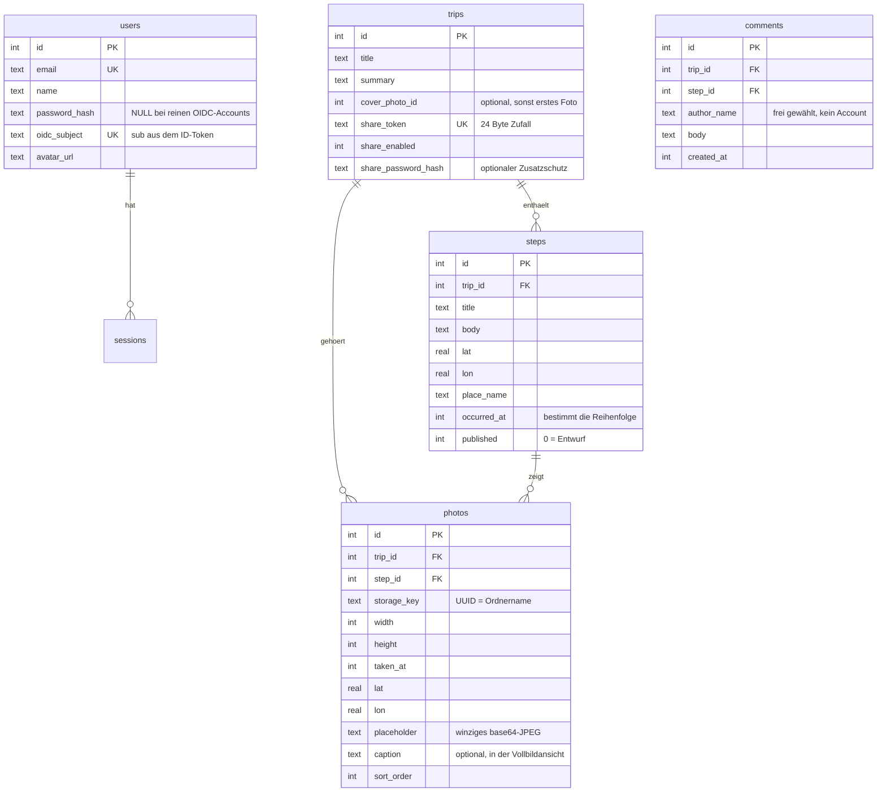
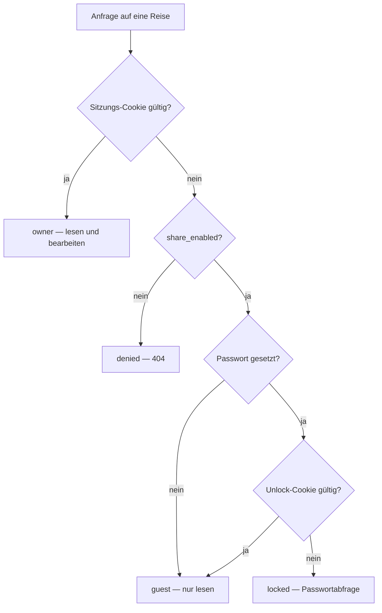

# OwnSteps – Architektur und Entscheidungen

Diese Datei richtet sich an alle, die am Code weiterarbeiten. Sie beschreibt,
wie die Teile zusammenhängen und **warum** sie so gebaut sind. Die
Bedienungs- und Deployment-Anleitung steht im [README](../README.md), die
Kurzfassung der wichtigsten Regeln in [AGENTS.md](../AGENTS.md).

Sprache im Code, in Kommentaren und in der Oberfläche ist durchgehend Deutsch.

---

## 1. Worum es geht

Ein Reisetagebuch als Polarsteps-Ersatz auf dem eigenen VPS. Man legt eine
Reise an, lädt unterwegs Fotos hoch und schreibt Text dazu; Ort und Zeitpunkt
kommen automatisch aus den EXIF-Daten. Familie und Freunde lesen über einen
geheimen Link mit, ohne Account.

Die Zielgröße bestimmt viele Entscheidungen: **zwei Autoren, ein Container,
eine Handvoll Reisen mit einigen hundert Fotos.** Nichts hier ist auf
Mandantenfähigkeit oder horizontale Skalierung ausgelegt, und das ist Absicht.

---

## 2. Technikstack

| Baustein | Wahl | Warum |
| --- | --- | --- |
| Framework | Next.js 16, App Router, Turbopack | Server Components halten die Datenlogik auf dem Server; SSR liefert dem Share-Link brauchbare OG-Vorschauen |
| Datenbank | SQLite über better-sqlite3 + Drizzle | Eine Datei, keine zweite Container-Instanz, Backup = Ordner kopieren |
| Bilder | sharp | Erzeugt die Web-Größen; Prebuilds für Linux vorhanden |
| EXIF | exifr | Liest GPS und Aufnahmezeit, verträgt fehlende und kaputte Metadaten |
| Karte | MapLibre GL **v5** | Freie Bibliothek, siehe Entscheidung [E9] zur Version |
| Kartendaten | MapTiler über eigenen Proxy | Schöner Vektor-Look, Key bleibt auf dem Server |
| Passwörter | bcryptjs | Reines JavaScript, keine nativen Bauprobleme |
| OIDC | jose | Nur JWKS-Prüfung nötig, keine schwere Auth-Bibliothek |
| Styling | Tailwind CSS v4 | Farbtokens in `globals.css`, hell und dunkel über CSS-Variablen |

---

## 3. Verzeichnisse

```
src/
├── app/
│   ├── (app)/            Alles hinter dem Login. Das Layout prüft die Sitzung
│   │   ├── page.tsx      Reise-Übersicht
│   │   ├── actions.ts    Server Actions für Reisen, Beiträge, Teilen
│   │   ├── settings/     Accounts, Passwort, Abmelden
│   │   └── trips/…       Reise-Ansicht, Beitrags-Editor, Reise verwalten
│   ├── s/[token]/        Öffentlicher Share-Link (kein Login-Layout!)
│   ├── login/, setup/    Anmeldung und Ersteinrichtung
│   ├── api/              Route Handler (siehe unten)
│   ├── layout.tsx        Wurzel-Layout, Metadaten, Viewport
│   ├── manifest.ts       PWA-Manifest ("zum Homescreen hinzufügen")
│   └── globals.css       Farbtokens, Komponentenklassen, MapLibre-Anpassungen
├── components/           Client-Komponenten (Karte, Timeline, Lightbox …)
├── db/                   Schema und Verbindung samt Migrationen
├── lib/                  Serverlogik, fast alles mit "server-only"
└── instrumentation.ts    Läuft einmal beim Serverstart
```

### Route Handler

| Pfad | Zweck |
| --- | --- |
| `POST /api/upload` | Fotos entgegennehmen, verarbeiten, Beitrag ergänzen |
| `DELETE /api/upload?photoId=` | Einzelnes Foto löschen |
| `GET /api/photos/[id]/[variant]` | Fotos ausliefern, **mit Zugriffsprüfung** |
| `GET /api/map/[...path]` | Proxy zu MapTiler, hängt den Key serverseitig an |
| `GET /api/geocode?lat=&lon=` | Ortsname für einen von Hand gesetzten Pin |
| `GET /api/geocode/search?q=` | Ortssuche mit Vorschlägen für den Editor |
| `GET /api/auth/oidc/start` | OIDC-Anmeldung beginnen |
| `GET /api/auth/oidc/callback` | Rückkehr vom Anbieter, Sitzung anlegen |
| `GET /api/health` | Healthcheck für Docker |

Alles andere läuft über **Server Actions** – Formulare funktionieren dadurch
auch ohne JavaScript, und es gibt keine handgeschriebene API-Schicht für die
eigenen Formulare.

---

## 4. Datenmodell



Wichtige Eigenheiten:

- **Zeitstempel sind Unix-Millisekunden als INTEGER.** Ausnahme sind
  `trips.start_date` / `end_date`, die als `YYYY-MM-DD` gedacht sind; sie
  werden aktuell nicht gepflegt, weil der Zeitraum aus den Beiträgen abgeleitet
  wird (`formatRange` in `src/lib/format.ts`).
- **`steps.occurred_at` bestimmt die Sortierung**, nicht `created_at`. Ein
  nachträglich hochgeladenes Foto rutscht dadurch an die richtige Stelle.
  Die **Uhrzeit wird nirgends angezeigt** und ist auch nicht einstellbar – im
  Editor gibt es nur ein Datum. Sie stammt aus den EXIF-Daten und sortiert
  mehrere Beiträge desselben Tages; `withDate()` in `format.ts` tauscht beim
  Speichern deshalb nur den Datumsanteil aus.
- **`steps.title` wird nicht mehr benutzt.** Als Überschrift dient der Ort
  (`place_name`). Die Spalte bleibt, damit vorhandene Installationen nicht
  umgebaut werden müssen.
- **`photos.trip_id` ist redundant** zu `steps.trip_id`, macht aber die
  Zugriffsprüfung beim Ausliefern zu einem einzigen Join und erlaubt Fotos
  ohne Beitrag.
- **`photos.step_id` ist löschbar (`ON DELETE CASCADE`)**: Beitrag weg,
  Fotozeilen weg. Die *Dateien* räumt `deletePhotoFilesFor` auf – das muss
  jeder Löschpfad selbst tun, SQLite kennt die Platte nicht.

---

## 5. Zugriffsmodell

Es gibt **keine Rollen und keine Besitzverhältnisse**: Wer angemeldet ist, darf
alles ([E2]). Die einzige echte Grenze verläuft zwischen „angemeldet" und
„hat einen Share-Link".

Alle Prüfungen laufen über **eine** Funktion, `resolveTripAccess`
(`src/lib/share.ts`):



- **Sitzungen**: 32 Byte Zufall im Cookie `ownsteps_session`, in der Datenbank
  liegt nur der SHA-256-Hash. Laufzeit 60 Tage, damit das Handy angemeldet
  bleibt.
- **Unlock-Cookie**: kein Zufallstoken, sondern eine HMAC-Signatur aus
  `APP_SECRET`, Trip-ID und dem Passwort-Hash. Ändert sich das Passwort,
  werden dadurch automatisch alle Entsperrungen ungültig – ohne dass irgendwo
  Zustand aufgeräumt werden müsste. Vergleich mit `timingSafeEqual`.
- **Nicht freigegebene Reisen antworten mit 404, nicht mit 403.** Ein 403
  würde bestätigen, dass es den Token gibt.

> **Regel:** Jeder neue Pfad, über den Reise-Inhalte nach außen gehen, muss
> `resolveTripAccess` benutzen. Das gilt besonders für Route Handler – dort
> greift kein Layout, das nebenbei die Anmeldung prüft.

### Kommentare

Wer die Reise sehen darf, darf auch kommentieren – Name und Text genügen, ein
Account ist nicht nötig. `addCommentAction` prüft dafür dieselbe Funktion
`resolveTripAccess`. Löschen darf nur, wer angemeldet ist.

Gegen versehentliche Doppelklicks und stumpfes Zumüllen steht in
`src/lib/comments.ts` eine Bremse: höchstens fünf Kommentare pro Minute und
Absenderadresse. Sie liegt bewusst im Arbeitsspeicher – bei einer Instanz für
zwei Familien wäre eine Tabelle dafür überzogen, und nach einem Neustart darf
sie ruhig bei null anfangen.

---

## 6. Bildpipeline

```
Browser ──(eine Datei pro Request)──> POST /api/upload
                                        │
                            exifr: GPS + Aufnahmezeit
                                        │
                            sharp: rotate() nach EXIF
                                        │
              ┌──────────────┬──────────┴───────┬──────────────┐
          thumb 480       medium 1280       large 2400      original
           WebP 70          WebP 78          WebP 80       unverändert
              └──────────────┴──────────────────┴──────────────┘
                       data/uploads/<storage_key>/
```

- **Hochgeladen wird Datei für Datei**, nicht als ein großer Request. Das hält
  den Speicherbedarf auf dem VPS klein und liefert unterwegs einen ehrlichen
  Fortschritt (`StepEditor.tsx`).
- **Ausgeliefert wird nur über `/api/photos/[id]/[variant]`.** Nichts liegt in
  `public/`, sonst wäre jedes Foto per URL-Raten öffentlich.
- **`placeholder`** ist ein etwa 20 px breites JPEG als Data-URI in der
  Datenbank. `PhotoImg` legt es als CSS-Hintergrund unter das ``; das
  ergibt einen Blur-up ohne eine Zeile JavaScript.
- **Nach `sharp.rotate()` tauschen hochkant aufgenommene Bilder Breite und
  Höhe.** `processUpload` korrigiert das anhand der EXIF-Orientierung – sonst
  stehen falsche Seitenverhältnisse in der Datenbank.
- **Aus dem ersten Foto mit GPS** übernimmt der Beitrag Ort und Aufnahmezeit,
  und `reverseGeocode` macht daraus einen Ortsnamen. Nur solange der Beitrag
  noch nichts Eigenes gesetzt hat.

---

## 7. Karte

`getMapStyle()` (`src/lib/map.ts`) wird **serverseitig** aufgelöst und liefert
entweder die Proxy-URL `/api/map/maps/<style>/style.json` (wenn ein
`MAPTILER_KEY` gesetzt ist) oder ein eingebettetes OpenStreetMap-Raster-Style
als Notnagel.

Der Proxy (`/api/map/[...path]`) reicht Anfragen an `api.maptiler.com` weiter
und hängt den Key erst dort an. Antworten mit JSON laufen durch
`rewriteMapTilerJson` (`src/lib/maptiler-rewrite.ts`), das

1. jede `https://api.maptiler.com/…` auf den eigenen Proxy umbiegt und
2. den `key=`-Parameter entfernt.

Die Umschreibung ist **absichtlich rein textbasiert**. Ein `URL`-Objekt würde
die Platzhalter `{z}/{x}/{y}` und `{fontstack}/{range}` prozentkodieren, und
MapLibre ersetzt nur wörtliche Klammern.

Die eingesetzte Adresse liefert `publicOrigin()`: zuerst `PUBLIC_URL`, sonst
`x-forwarded-proto` und `x-forwarded-host`, erst zuletzt `request.url`. Diese
Reihenfolge ist zweimal wichtig:

- **`request.url` allein ist hinter einem Reverse Proxy falsch.** Dort endet
  TLS beim Proxy, der Server selbst spricht HTTP. Die erzeugte
  `http://…`-Adresse blockiert der Browser auf einer HTTPS-Seite als Mixed
  Content – die Karte bleibt ohne Fehlermeldung leer.
- **Ein bloßer Pfad (`/api/map/…`) reicht nicht.** Die Vektorkacheln lädt
  MapLibre in einem Worker, der aus einem Blob erzeugt wird; dessen `location`
  ist eine `blob:`-URL und taugt nicht als Basis für relative Adressen. Die
  Kacheln kämen nie an, während Hintergrund und Beschriftung schon stünden –
  sichtbar als einfarbige Fläche.

Deshalb steht `PUBLIC_URL` nicht nur für die Share-Links, sondern macht auch
die Karte hinter einem Proxy eindeutig.

Das Ziel wird über `target.origin !== UPSTREAM` geprüft, damit der Pfad nicht
auf einen fremden Host zeigen kann. Eine Sperre gegen
`Sec-Fetch-Site: cross-site` gab es zwischenzeitlich, sie ist wieder
entfernt: Wer den Header weglässt, kam ohnehin durch – der Schutz war also
keiner – während sie Anfragen aus MapLibres Worker blockieren konnte.

**Die umgeschriebenen JSON-Antworten werden mit `no-cache` ausgeliefert**, die
Kacheln, Sprites und Schriften dagegen für einen Tag. Der Unterschied ist
wichtig: In den JSON-Dateien stecken die aus `PUBLIC_URL` gebauten Adressen.
Mit langer Frist hält ein Browser nach einem Umzug oder einer
Konfigurationsänderung tagelang an toten URLs fest, und die Karte bleibt leer,
obwohl der Server längst das Richtige liefert. Genau das ist beim ersten
Deployment passiert – die Fehlersuche lief ins Leere, weil `curl` korrekte
Adressen zeigte und der Browser trotzdem alte benutzte.

Voreingestellt ist der Stil **`hybrid`** (Satellitenbild mit dezenter
Beschriftung). Auf Luftbildern wirken die Fotomarker und die Route deutlich
besser als auf einer Straßenkarte – das war der sichtbarste Unterschied zum
Vorbild Polarsteps. Dazu passend: die Route als **weiße Linie mit dunklem
Saum** (zwei Layer übereinander) und Marker mit **weißem Ring** statt
farbiger Hervorhebung. Die aktive Station wächst nur, damit das Foto wirkt und
nicht die Signalfarbe. Andere Stile lassen sich über `MAP_STYLE` setzen,
etwa `satellite`, `outdoor-v2` oder `streets-v2`.

Über der Karte liegt mit `MapTimelineStrip` eine Leiste, durch die man die
Stationen blättert; sie rastet je Eintrag ein und zieht die Karte mit. Ein
Antippen der bereits aktiven Station springt zum Beitrag in der Timeline.

**Im Kartenmodus wird die Höhe gemessen, nicht gerechnet.** Auf dem Handy soll
die Karte bis zum unteren Rand reichen; wie viel Platz über ihr liegt, hängt
aber von der Ansicht ab – die angemeldete hat eine Kopfleiste, der Share-Link
nicht. Eine feste Rechnung wie `100dvh - 11rem` ließ die Karte in der
Besucheransicht auf ein Drittel schrumpfen. Jetzt liefert
`getBoundingClientRect().top` den Startpunkt, und der Kopfbereich tritt auf
schmalen Bildschirmen ganz zurück.

In `TripMap.tsx` gilt:

- **Marker hängen nicht am `load`-Ereignis.** Sie sind gewöhnliche
  DOM-Elemente und werden sofort gesetzt; auch wenn keine Kachel durchkommt,
  sieht man die Stationen.
- Die **Routenlinie** ist ein Style-Layer und braucht ein geladenes Style.
  `syncRoute` läuft deshalb sofort *und* auf `load` *und* auf `styledata` –
  die Funktion ist bewusst idempotent.
- Ein `ResizeObserver` ruft `map.resize()`, weil der Container auf dem Handy
  zwischen sichtbar und versteckt wechselt.
- **Die Kamera folgt nur, wenn sich die Punkte geändert haben** (Vergleich
  einer Signatur aus IDs und Koordinaten). Ohne das setzte jeder Tastendruck
  im Editor die Ansicht zurück. Mit `autoFit={false}` richtet sie sich
  überhaupt nur einmal aus – wer dort einen Ort sucht, bestimmt den Ausschnitt
  selbst.
- `map.on("error", …)` loggt Style- und Kachelfehler, die MapLibre sonst
  stillschweigend schluckt.

---

## 8. Anmeldung

**Passwort** (`src/lib/auth.ts`): bcrypt mit Kostenfaktor 12. `verifyPassword`
vergleicht auch dann gegen einen Dummy-Hash, wenn der Account gar kein
Passwort hat – sonst verriete die Antwortzeit, welche Accounts existieren.

**OIDC** (`src/lib/oidc.ts`), Authorization Code Flow mit PKCE:

```
/api/auth/oidc/start
   → PKCE-Verifier, state, nonce, Ziel in ein kurzlebiges Cookie
   → Weiterleitung zum authorization_endpoint
Anbieter (Pocket ID)
   → zurück auf /api/auth/oidc/callback
   → state prüfen, Code gegen Token tauschen
   → ID-Token per JWKS prüfen (Aussteller, Empfänger, nonce)
   → upsertOidcUser: erst über sub, dann über E-Mail, sonst neu anlegen
   → Sitzung anlegen, weiter zum ursprünglichen Ziel
```

Das `next`-Ziel wird auf seiteninterne Pfade begrenzt, damit der Login nicht
als offene Weiterleitung dient. `OIDC_ALLOWED_EMAILS` kann den Kreis
zusätzlich einschränken.

Ist noch kein Account vorhanden, führt `/login` auf `/setup`. Diese Seite
sperrt sich selbst, sobald ein Account existiert. Alternativ legen
`ADMIN_EMAIL` / `ADMIN_PASSWORD` beim ersten Start einen Account an
(`seedAdminFromEnv` in `instrumentation.ts`).

---

## 9. Migrationen

Es gibt **kein** `drizzle-kit generate` und keine Migrationsdateien. Stattdessen
steht in `src/db/index.ts` das Array `MIGRATIONS` mit benanntem SQL. Beim Start
wird alles ausgeführt, was noch nicht in der Tabelle `_migrations` steht.

> **Regel: nur anhängen, nie einen bestehenden Eintrag ändern.** Wer `0001_init`
> anpasst, ändert nichts an bereits laufenden Installationen – dort ist die
> Migration längst abgehakt.

Wird das Drizzle-Schema in `src/db/schema.ts` erweitert, gehört dazu **immer**
ein neuer `MIGRATIONS`-Eintrag; das Schema selbst erzeugt keine Tabellen.

Der Start ist gegen gleichzeitige Prozesse abgesichert (Next startet für den
Build mehrere Worker, und beim Containerneustart überlappen alt und neu):

1. `busy_timeout` wird **als Erstes** gesetzt.
2. `journal_mode = WAL` läuft mit Wiederholungen und toleriert ein Scheitern –
   der Modus steht in der Datei, ein anderer Prozess kann ihn gesetzt haben.
   SQLite wendet den busy-Handler bei diesem Pragma ausdrücklich nicht an.
3. Die Migration läuft in einer `immediate()`-Transaktion, **der Abgleich mit
   `_migrations` passiert darin**, plus `INSERT OR IGNORE`.

---

## 10. Getroffene Entscheidungen

### [E1] SQLite statt PostgreSQL
Zwei Nutzer, ein Container, ein Volume. Eine zweite Datenbank-Instanz würde den
Betrieb verkomplizieren, ohne etwas beizutragen. Backup ist ein `tar` über
`data/`. Grenze: echte Gleichzeitigkeit beim Schreiben gibt es nicht – bei
dieser Nutzung irrelevant.

### [E2] Keine Rechteverwaltung
Ausdrücklicher Wunsch: zwei Personen, die gemeinsam an denselben Reisen
schreiben. Jeder angemeldete Account darf jede Reise bearbeiten. `requireUser()`
ist die gesamte Autorisierung. **Nicht „nachbessern", ohne dass es gewünscht
wird** – die Einfachheit ist der Punkt.

### [E3] Eigene Sitzungsverwaltung statt Auth.js
Für Cookie plus Datenbanktabelle braucht es keine Bibliothek mit Adapter-Schicht.
Der gesamte Code steht in `src/lib/auth.ts` und ist in einer Sitzung lesbar.
OIDC kam später dazu und passte ohne Umbau daneben.

### [E4] Fotos hinter einer geprüften Route
Dateien in `public/` wären für jeden erreichbar, der die URL errät oder
mitgeteilt bekommt – bei privaten Reisefotos inakzeptabel. Der Umweg über
`/api/photos/…` kostet etwas Durchsatz, den ein privater VPS problemlos hat.
Cache-Header `private, max-age=31536000, immutable`, weil `storage_key` pro
Bild einmalig ist.

### [E5] Kein `next/image`
Die Varianten sind beim Upload bereits als WebP vorgerechnet. Eine zweite
Optimierungsschicht würde nur Rechenzeit und Cache-Platz kosten. Der Blur-up
kommt aus dem gespeicherten Platzhalter.

### [E6] MapTiler-Key über einen Proxy
Bei einem geteilten Link läge der Key sonst im Quelltext jeder öffentlichen
Reise und wäre binnen Kurzem fremdgenutzt. Der Proxy ist der Grund, warum es
`maptiler-rewrite.ts` überhaupt gibt.

### [E7] Beitrag wird beim ersten Foto veröffentlicht
Der Editor legt beim Öffnen einen Entwurf an (`createDraftStep`), damit die
Fotos sofort ein Ziel haben. Würde der Beitrag erst beim Speichern sichtbar,
wäre unterwegs hochgeladenes Material weg, sobald jemand die Seite verlässt.
Deshalb setzt `/api/upload` `published = true`, sobald ein Foto durch ist.
Entwürfe ohne Fotos räumt `cleanupStaleDrafts` nach sieben Tagen ab.

### [E8] Ort primär aus EXIF, mit drei Rückfallebenen
Ausdrücklicher Wunsch: unterwegs soll nichts von Hand eingetragen werden
müssen. In der Praxis reicht das nicht – iOS entfernt die Position je nach
Weg beim Teilen. Deshalb gibt es zusätzlich, in dieser Reihenfolge:
**„Mein Standort"** (Position des Geräts), die **Ortssuche** im Ortsfeld
(MapTiler-Geocoding, Auswahl setzt Namen, Koordinaten und Kartenausschnitt)
und als Letztes das **Antippen der Karte**.

### [E9] maplibre-gl auf Version 5 festhalten
v6 leitet die Adresse seines Workers aus `import.meta.url` ab. Nach dem Bündeln
zeigt das auf einen Pfad unterhalb von `_next/static/chunks/`, wo kein Worker
liegt; Next liefert dort seine 404-Seite, und der Browser lehnt sie als
Modul-Script ab („non-JavaScript MIME type"). Die Karte bleibt dann ohne jede
Fehlermeldung stehen. v5 bringt den Worker als Blob mit und hat das Problem
nicht. **Vor einem Upgrade auf v6 muss die Kartendarstellung im echten Browser
geprüft werden.**

### [E10] Debian statt Alpine im Image, Installation ohne Scripts
`better-sqlite3` und `sharp` bringen fertige Binärdateien für glibc mit. Auf
musl müsste zumindest `sharp` über die passende Plattform-Variante aufgelöst
werden. Die paar hundert MB Image sind auf einem VPS kein Thema.

Installiert wird mit **`npm ci --ignore-scripts`**. Grund: `better-sqlite3`
enthält eine `binding.gyp`, und npm startet bei deren Anwesenheit von sich aus
`node-gyp rebuild` – auch ohne `install`-Script im Paket. Im slim-Image gibt es
weder Python noch Compiler, der Build bricht dort ab:

```
gyp ERR! find Python – Could not find any Python installation to use
```

Kompiliert werden muss aber gar nichts, das Paket liefert Binaries für
linux-x64 und linux-arm64 mit (nachgeprüft: Datenbank und `sharp` laufen nach
einer Installation ohne Scripts einwandfrei). Sollte später ein Paket
hinzukommen, das ein install-Script wirklich benötigt, muss in der deps-Stage
`python3 make g++` installiert werden – dann aber bitte nur dort, damit das
Laufzeit-Image schlank bleibt.

### [E11] Deutsch als Projektsprache
Oberfläche, Kommentare, Commit-Nachrichten, Fehlermeldungen. Gemischte Sprachen
in einer so kleinen Codebasis lesen sich schlechter als eine konsequente.

### [E12] Zeitzonen bewusst unbehandelt
EXIF-Aufnahmezeiten tragen selten eine Zeitzone. Gelesen und formatiert wird in
der Zeitzone des Servers, dadurch zeigt die Oberfläche genau die Uhrzeit, die
die Kamera notiert hat. Für ein Reisetagebuch ist das die gewünschte Lesart –
ein Foto vom Sonnenaufgang in Norwegen soll die dortige Uhrzeit zeigen. Wer den
Container umzieht, sollte `TZ` stabil halten.

---

## 11. Fallstricke

**Seiten, die den Anmeldestand lesen, brauchen `export const dynamic = "force-dynamic"`.**
Sonst rendert Next sie beim Build vor und backt den Zustand der *Bau*-Datenbank
ein. Genau das ist `/setup` passiert: Die Seite wurde mit dem Redirect
„Account existiert bereits" ausgeliefert, wodurch die Ersteinrichtung auf einem
frischen Server unmöglich wurde. Prüfbar an der Build-Ausgabe – dort muss vor
der Route ein `ƒ` stehen, kein `○`.

**Route Handler haben keine Schutzschicht über sich.** `src/app/(app)/layout.tsx`
prüft die Sitzung nur für Seiten. Jeder Handler unter `src/app/api/` muss
`getCurrentUser()` oder `resolveTripAccess()` selbst aufrufen.

**In `route.ts` sind nur die erwarteten Exporte erlaubt** (`GET`, `POST`,
`dynamic` …). Ein zusätzlicher Hilfsexport lässt den Build scheitern; deshalb
liegen `OIDC_FLOW_COOKIE` und `redirectUriFor` in `src/lib/oidc.ts`.

**Dateien überleben das Löschen von Datenbankzeilen.** `ON DELETE CASCADE`
räumt nur Zeilen ab. Jeder Löschpfad muss die Storage-Ordner selbst entfernen –
siehe `deleteTrip`, `deleteStep`, `deletePhoto`.

**Die meisten Module in `src/lib/` sind mit `server-only` markiert.** Aus
Client-Komponenten dürfen daraus **nur** diese beiden importiert werden:

- `src/lib/view-types.ts` – die serialisierbaren Formen für Server→Client
- `src/lib/format.ts` – Datums- und Zahlenformatierung

Zwei Module tragen kein `server-only`, gehören aber trotzdem auf den Server:
`map.ts` (importiert `env.ts` und damit den MapTiler-Key) und
`maptiler-rewrite.ts` (reine Funktion, nur ohne Marker, damit sie sich einzeln
testen lässt). `getMapStyle()` wird deshalb in einer Server-Komponente
aufgelöst und das Ergebnis als Prop weitergereicht – siehe
`src/app/(app)/trips/[id]/page.tsx`.

**Turbopack spurt dynamische Dateipfade.** `DATA_DIR` trägt deshalb einen
`/* turbopackIgnore: true */`-Hinweis; ohne ihn landet das halbe Projekt im
Standalone-Bundle.

**Ein Bind-Mount verdeckt die Rechte aus dem Image.** Das `chown -R node:node
/data` im Dockerfile wirkt nur auf das Verzeichnis *im Image*; sobald der
Host-Ordner darübergemountet wird, gelten dessen Besitzverhältnisse – und
Docker legt fehlende Host-Verzeichnisse als root an. Der Serverprozess läuft
als `node` (UID 1000) und scheiterte dadurch beim Start mit
`EACCES: permission denied, mkdir '/data/uploads'`.

Deshalb startet der Container über `docker-entrypoint.js`: Er läuft kurz als
root, legt `uploads/` an, übereignet das Datenverzeichnis – aber nur, wenn die
Besitzverhältnisse oben nicht schon stimmen, sonst wäre das bei vielen Fotos
ein langer Lauf bei jedem Start – und wechselt dann per `setuid` auf `node`.
Wird der Container mit festem `user:` gestartet, entfällt der Wechsel; dann
prüft der Entrypoint nur die Schreibrechte und meldet im Klartext, was zu tun
ist. Aus demselben Grund steht im Dockerfile **kein** `USER node`.

**Containernamen lassen sich nur in Bridge-Netzen auflösen.** Ein Proxy oder
Tunnel-Client mit `network_mode: host` (etwa Pangolins `newt`) erreicht die App
**nicht** über `http://ownsteps:2555`, sondern über den auf dem Host gemappten
Port `127.0.0.1:2555`. Die Container-IP aus `docker inspect` taugt in keinem
der beiden Fälle als Ziel – sie wechselt bei jedem Neustart und führt danach zu
`Bad Gateway`. `BIND_ADDRESS` in der `.env` beschränkt das Port-Mapping auf
`127.0.0.1`, sobald ein Proxy davorsteht.

**Neue Abhängigkeiten mit nativen Anteilen im Docker-Build prüfen.** Die
Installation läuft mit `--ignore-scripts` (Begründung unter [E10]); ein Paket,
das auf sein install-Script angewiesen ist, fällt dabei still aus. Gegenprobe
ohne Docker: `npm ci --ignore-scripts` in einem leeren Verzeichnis mit
`package.json` und `package-lock.json`, danach das Paket testweise laden.

---

## 12. Stand der Prüfung

Verifiziert (Produktions-Build, echte HTTP-Anfragen):

- Kartenauslieferung über den Proxy mit echtem MapTiler-Key: Style (90 Layer),
  TileJSON, eine echte Vektorkachel (~250 kB Protobuf), Sprite als JSON und
  PNG sowie eine Schriftart – überall ohne API-Key in der Antwort
- Upload mit EXIF-Auswertung: GPS, Aufnahmezeit, Platzhalter, alle drei Größen
- Zugriffsschutz auf Fotos: 401 ohne Anmeldung beim Upload, 403 beim Abruf,
  200 über einen freigegebenen Share-Link, 403 bei gesetztem Passwort
- Share-Ansicht mit OG-Tags und `noindex`; kein Vorschaubild bei Passwortschutz
- Anmeldung über die echte Server Action samt Cookie und Weiterleitung
- Weiterleitungen: `/` → `/login` → `/setup` auf leerer Datenbank
- Timeline-Aufbereitung: Tageszählung und Datumsformate stimmen mit den
  EXIF-Zeiten überein
- Umschreibung des MapTiler-Styles: Key entfernt, Platzhalter unversehrt
- Gleichzeitiger Start: sechs Prozesse auf leerer Datenbank, genau eine
  Migration, keine Sperrfehler; fünf Builds auf frischer Datenbank in Folge

Nicht verifiziert – hier ist beim Weiterbauen Vorsicht angebracht:

- **Das Docker-Image wurde nie gebaut** (fehlende Rechte am Docker-Socket in
  der Entwicklungsumgebung). Geprüft wurde stattdessen der Standalone-Build,
  also der Teil, den das Dockerfile bloß kopiert.
- **Das gerenderte Kartenbild wurde nie gesehen.** Der Testbrowser rendert
  keine Frames, wodurch MapLibres Render-Schleife nie anläuft. Marker-Erzeugung
  und die Auslieferung aller Kartendaten sind geprüft, die Darstellung selbst
  nicht.
- **OIDC lief nie gegen eine echte Instanz.** Der Fluss ist nach Spezifikation
  gebaut, aber ungetestet.
- **Kein automatisierter Test** ist eingerichtet.

---

## 13. Naheliegende nächste Schritte

Nichts davon ist angefangen; die Liste ist eine Orientierung, keine Zusage.

- Reihenfolge der Fotos innerhalb eines Beitrags per Ziehen ändern
  (`photos.sort_order` ist dafür schon da)
- Reisezeitraum von Hand setzen (`trips.start_date` / `end_date` liegen ungenutzt)
- Karten-Stil pro Reise wählbar machen (`MAP_STYLE` ist derzeit global)
- Originale über die Oberfläche herunterladbar machen; dafür müsste der
  Medientyp der Originaldatei mitgespeichert werden, er steht bisher nirgends
- Automatisierte Tests für `resolveTripAccess` und `processUpload` – die beiden
  Stellen, an denen ein Fehler am teuersten wäre
